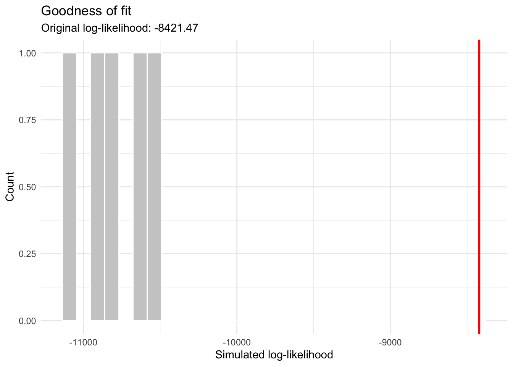

# How to use lifelihood

## Load libraries

``` r

library(lifelihood)
#> Loading required package: tidyverse
#> ── Attaching core tidyverse packages ──────────────────────── tidyverse 2.0.0 ──
#> ✔ dplyr     1.2.0     ✔ readr     2.2.0
#> ✔ forcats   1.0.1     ✔ stringr   1.6.0
#> ✔ ggplot2   4.0.2     ✔ tibble    3.3.1
#> ✔ lubridate 1.9.5     ✔ tidyr     1.3.2
#> ✔ purrr     1.2.1     
#> ── Conflicts ────────────────────────────────────────── tidyverse_conflicts() ──
#> ✖ dplyr::filter() masks stats::filter()
#> ✖ dplyr::lag()    masks stats::lag()
#> ℹ Use the conflicted package (<http://conflicted.r-lib.org/>) to force all conflicts to become errors
library(tidyverse)
```

## Fit a simple model

``` r

df <- datapierrick |>
  as_tibble() |>
  mutate(
    par = as.factor(par),
    geno = as.factor(geno),
    spore = as.factor(spore)
  ) |>
  sample_n(120)

generate_clutch_vector <- function(N) {
  return(paste(
    "pon",
    rep(c("start", "end", "size"), N),
    rep(1:N, each = 3),
    sep = "_"
  ))
}

lifelihoodData <- as_lifelihoodData(
  df = df,
  sex = "sex",
  sex_start = "sex_start",
  sex_end = "sex_end",
  maturity_start = "mat_start",
  maturity_end = "mat_end",
  clutchs = generate_clutch_vector(28),
  death_start = "death_start",
  death_end = "death_end",
  covariates = c("par", "spore"),
  model_specs = c("wei", "gam", "exp")
)

results <- lifelihood(
  lifelihoodData,
  path_config = use_test_config("config_pierrick"),
  raise_estimation_warning = FALSE
)
#> [1] "/Users/runner/work/_temp/Library/lifelihood/bin/lifelihood-macos /Users/runner/work/Lifelihood/Lifelihood/lifelihood_1637_9440_7240_2902/temp_file_data_lifelihood.txt /Users/runner/work/Lifelihood/Lifelihood/lifelihood_1637_9440_7240_2902/temp_param_range_path.txt 0 25 FALSE 0 FALSE 0 1637 9440 7240 2902 10 20 1000 0.3 NULL 2 2 50 1 1 0.001"
```

## Goodness of fit

The goodness of fit simulate datasets from a fitted model (`results)`,
refit the model on each simulated dataset (`nsim`), and compare
simulated log-likelihood values to the original fit.

``` r

gof <- goodness_of_fit(results, nsim = 5)
#> [1] "/Users/runner/work/_temp/Library/lifelihood/bin/lifelihood-macos /Users/runner/work/Lifelihood/Lifelihood/lifelihood_7648_5486_4681_962/temp_file_data_lifelihood.txt /Users/runner/work/Lifelihood/Lifelihood/lifelihood_7648_5486_4681_962/temp_param_range_path.txt 0 25 FALSE 0 FALSE 0 7648 5486 4681 962 10 20 1000 0.3 NULL 2 2 50 1 1 0.001"
#> [1] "/Users/runner/work/_temp/Library/lifelihood/bin/lifelihood-macos /Users/runner/work/Lifelihood/Lifelihood/lifelihood_3107_7972_5895_4139/temp_file_data_lifelihood.txt /Users/runner/work/Lifelihood/Lifelihood/lifelihood_3107_7972_5895_4139/temp_param_range_path.txt 0 25 FALSE 0 FALSE 0 3107 7972 5895 4139 10 20 1000 0.3 NULL 2 2 50 1 1 0.001"
#> [1] "/Users/runner/work/_temp/Library/lifelihood/bin/lifelihood-macos /Users/runner/work/Lifelihood/Lifelihood/lifelihood_7746_3444_9941_1815/temp_file_data_lifelihood.txt /Users/runner/work/Lifelihood/Lifelihood/lifelihood_7746_3444_9941_1815/temp_param_range_path.txt 0 25 FALSE 0 FALSE 0 7746 3444 9941 1815 10 20 1000 0.3 NULL 2 2 50 1 1 0.001"
#> [1] "/Users/runner/work/_temp/Library/lifelihood/bin/lifelihood-macos /Users/runner/work/Lifelihood/Lifelihood/lifelihood_840_5815_6591_1546/temp_file_data_lifelihood.txt /Users/runner/work/Lifelihood/Lifelihood/lifelihood_840_5815_6591_1546/temp_param_range_path.txt 0 25 FALSE 0 FALSE 0 840 5815 6591 1546 10 20 1000 0.3 NULL 2 2 50 1 1 0.001"
#> [1] "/Users/runner/work/_temp/Library/lifelihood/bin/lifelihood-macos /Users/runner/work/Lifelihood/Lifelihood/lifelihood_2547_9781_9983_7493/temp_file_data_lifelihood.txt /Users/runner/work/Lifelihood/Lifelihood/lifelihood_2547_9781_9983_7493/temp_param_range_path.txt 0 25 FALSE 0 FALSE 0 2547 9781 9983 7493 10 20 1000 0.3 NULL 2 2 50 1 1 0.001"
```

The
[`goodness_of_fit()`](https://nrode.github.io/Lifelihood/reference/goodness_of_fit.md)
function returns an instance of class `lifelihoodGOF`, with the
following attributes:

``` r

gof$original_loglik
#> [1] -8421.467
gof$simulated_loglik
#> [1] -10664.85 -10775.55 -11090.97 -10890.08 -10525.57
gof$n_success
#> [1] 5
gof$n_failed
#> [1] 0
gof$p_lower_or_equal
#> [1] 1
```

You can also read the `gof$fits` attribute for all underlying fits. Use
`gof$fits[[1]]` for the first one, `gof$fits[[2]]` for the second, and
so on.

## Visualization

You can use the [`plot()`](https://rdrr.io/r/graphics/plot.default.html)
S3 method on the output of
[`goodness_of_fit()`](https://nrode.github.io/Lifelihood/reference/goodness_of_fit.md):

``` r

plot(gof)
```



We can see here that the simulated datasets, when fitted, have a less
good log-likelihood compared to the original fit. This might suggest
that the original fit isn’t that great.
