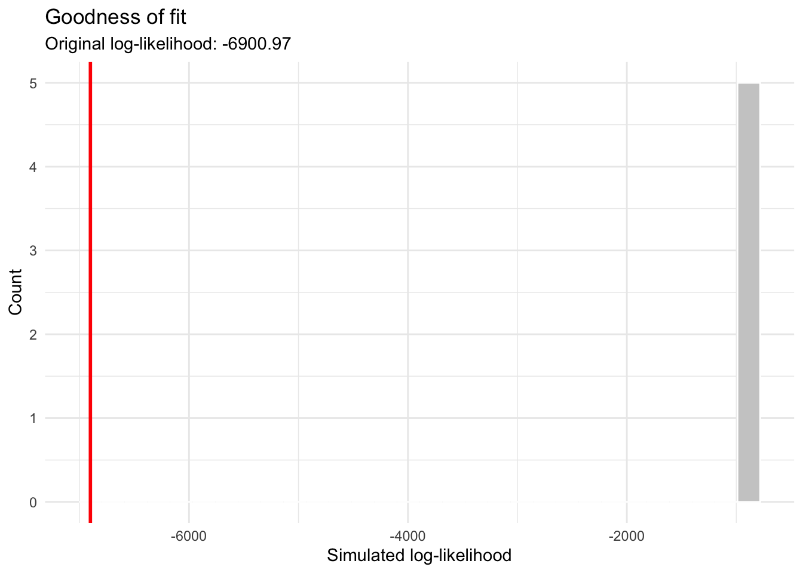

# Goodness of fit

## Load libraries

\
[`library`](https://rdrr.io/r/base/library.html)`(`[`lifelihood`](https://nrode.github.io/Lifelihood/)`)`\
`#> Loading required package: tidyverse`\
`#> ── Attaching core tidyverse packages ──────────────────────── tidyverse 2.0.0 ──`\
`#> ✔ dplyr     1.2.1     ✔ readr     2.2.0`\
`#> ✔ forcats   1.0.1     ✔ stringr   1.6.0`\
`#> ✔ ggplot2   4.0.3     ✔ tibble    3.3.1`\
`#> ✔ lubridate 1.9.5     ✔ tidyr     1.3.2`\
`#> ✔ purrr     1.2.2     `\
`#> ── Conflicts ────────────────────────────────────────── tidyverse_conflicts() ──`\
`#> ✖ dplyr::filter() masks stats::filter()`\
`#> ✖ dplyr::lag()    masks stats::lag()`\
`#> ℹ Use the conflicted package (<http://conflicted.r-lib.org/>) to force all conflicts to become errors`\
[`library`](https://rdrr.io/r/base/library.html)`(`[`tidyverse`](https://tidyverse.tidyverse.org)`)`

## Fit a simple model

\
`df`` ``<-`` ``datapierrick`` ``|>`\
`  `[`as_tibble`](https://tibble.tidyverse.org/reference/as_tibble.html)`(``)`` ``|>`\
`  `[`mutate`](https://dplyr.tidyverse.org/reference/mutate.html)`(`\
`    par ``=`` `[`as.factor`](https://rdrr.io/r/base/factor.html)`(``par``)``,`\
`    geno ``=`` `[`as.factor`](https://rdrr.io/r/base/factor.html)`(``geno``)``,`\
`    spore ``=`` `[`as.factor`](https://rdrr.io/r/base/factor.html)`(``spore``)`\
`  ``)`` ``|>`\
`  `[`sample_n`](https://dplyr.tidyverse.org/reference/sample_n.html)`(``120``)`\
\
`lifelihoodData`` ``<-`` `[`as_lifelihoodData`](https://nrode.github.io/Lifelihood/reference/as_lifelihoodData.md)`(`\
`  df ``=`` ``df``,`\
`  matclutch ``=`` ``FALSE``,`\
`  sex ``=`` ``"sex"``,`\
`  sex_start ``=`` ``"sex_start"``,`\
`  sex_end ``=`` ``"sex_end"``,`\
`  maturity_start ``=`` ``"mat_start"``,`\
`  maturity_end ``=`` ``"mat_end"``,`\
`  clutchs ``=`` `[`generate_clutch_vector`](https://nrode.github.io/Lifelihood/reference/generate_clutch_vector.md)`(``28``)``,`\
`  death_start ``=`` ``"death_start"``,`\
`  death_end ``=`` ``"death_end"``,`\
`  covariates ``=`` `[`c`](https://rdrr.io/r/base/c.html)`(``"par"``, ``"spore"``)``,`\
`  dist ``=`` `[`c`](https://rdrr.io/r/base/c.html)`(``mortality ``=`` ``"wei"``, maturity ``=`` ``"gam"``, reproduction ``=`` ``"exp"``)`\
`)`\
\
`results`` ``<-`` `[`lifelihood`](https://nrode.github.io/Lifelihood/reference/lifelihood.md)`(`\
`  ``lifelihoodData``,`\
`  path_config ``=`` `[`use_test_config`](https://nrode.github.io/Lifelihood/reference/use_test_config.md)`(``"config_pierrick"``)``,`\
`  raise_estimation_warning ``=`` ``FALSE`\
`)`

## Goodness of fit

The goodness of fit simulate datasets from a fitted model (`results)`,
refit the model on each simulated dataset (`nsim`), and compare
simulated log-likelihood values to the original fit.

\
`gof`` ``<-`` `[`goodness_of_fit`](https://nrode.github.io/Lifelihood/reference/goodness_of_fit.md)`(``results``, nsim ``=`` ``5``)`

The
[`goodness_of_fit()`](https://nrode.github.io/Lifelihood/reference/goodness_of_fit.md)
function returns an instance of class `lifelihoodGOF`, with the
following attributes:

\
`gof``$``original_loglik`\
`#> [1] -7925.106`\
`gof``$``simulated_loglik`\
`#> [1] -889.3337 -889.1103 -889.0665 -889.0406 -889.0648`\
`gof``$``n_success`\
`#> [1] 5`\
`gof``$``n_failed`\
`#> [1] 0`\
`gof``$``p_lower_or_equal`\
`#> [1] 0`

You can also read the `gof$fits` attribute for all underlying fits. Use
`gof$fits[[1]]` for the first one, `gof$fits[[2]]` for the second, and
so on.

## Visualization

You can use the [`plot()`](https://rdrr.io/r/graphics/plot.default.html)
S3 method on the output of
[`goodness_of_fit()`](https://nrode.github.io/Lifelihood/reference/goodness_of_fit.md):

\
[`plot`](https://rdrr.io/r/graphics/plot.default.html)`(``gof``)`

We can see here that the simulated datasets, when fitted, have a less
good log-likelihood compared to the original fit. This might suggest
that the original fit isn’t that great.
