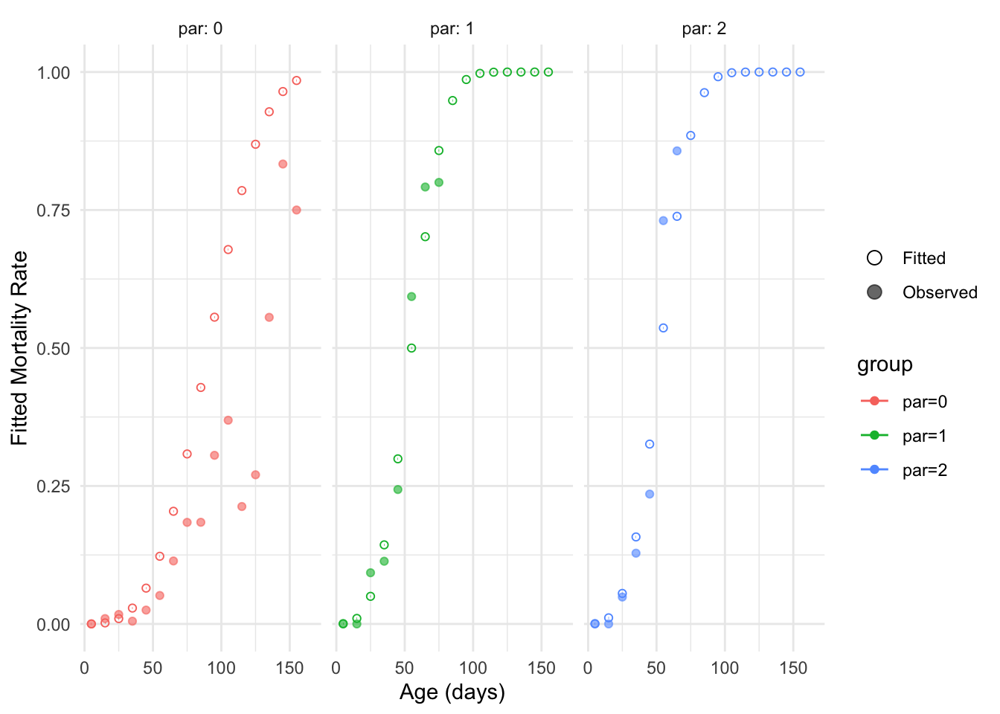

# Standard errors and MCMC

## Create a `lifelihoodData` object

``` r

library(lifelihood)
#> Loading required package: tidyverse
#> ── Attaching core tidyverse packages ──────────────────────── tidyverse 2.0.0 ──
#> ✔ dplyr     1.2.1     ✔ readr     2.2.0
#> ✔ forcats   1.0.1     ✔ stringr   1.6.0
#> ✔ ggplot2   4.0.3     ✔ tibble    3.3.1
#> ✔ lubridate 1.9.5     ✔ tidyr     1.3.2
#> ✔ purrr     1.2.2     
#> ── Conflicts ────────────────────────────────────────── tidyverse_conflicts() ──
#> ✖ dplyr::filter() masks stats::filter()
#> ✖ dplyr::lag()    masks stats::lag()
#> ℹ Use the conflicted package (<http://conflicted.r-lib.org/>) to force all conflicts to become errors
library(tidyverse)

df <- datapierrick |>
  as_tibble() |>
  mutate(
    par = as.factor(par),
    geno = as.factor(geno),
    spore = as.factor(spore),
    block = rep(1:2, each = nrow(datapierrick) / 2)
  )

clutchs <- generate_clutch_vector(28)

lifelihoodData <- as_lifelihoodData(
  df = df,
  matclutch = FALSE,
  sex = "sex",
  sex_start = "sex_start",
  sex_end = "sex_end",
  maturity_start = "mat_start",
  maturity_end = "mat_end",
  clutchs = clutchs,
  block = "block",
  death_start = "death_start",
  death_end = "death_end",
  covariates = c("par", "spore"),
  dist = c("wei", "gam", "lgn")
)
```

## Standard errors

By default, lifelihood will not try to fit standard errors. But, you can
use the `se.fit` argument for this purpose:

``` r


## Fail to compute standard errors due to absence of convergence to the ML optimum
results_wrong <- lifelihood(
  lifelihoodData = lifelihoodData,
  path_config = use_test_config("example_config_se"),
  se.fit = TRUE,
  seed = c(103, 349, 1213, 1283)
)

## Change sees to converge to the ML optimum
set.seed(123)
results <- lifelihood(
  lifelihoodData = lifelihoodData,
  path_config = use_test_config("example_config_se"),
  se.fit = TRUE,
  n_fit = 5
)
#> Warning in lifelihood(lifelihoodData = lifelihoodData, path_config =
#> use_test_config("example_config_se"), : Best and second-best likelihoods differ
#> by 0.552 (> 0.1). Consider increasing n_fit (currently 5) to be sure of model
#> convergence and find the model with highest log-likelihood.

## New model has better convergence
logLik(results_wrong)
#> [1] -343783.4
logLik(results)
#> [1] -343783.9

summary(results)
#> 
#> === LIFELIHOOD RESULTS ===
#> 
#> Sample size: 550 
#> 
#> --- Model Fit ---
#> Log-likelihood:  -343783.924
#> AIC:             687575.8
#> BIC:             687593.1
#> 
#> --- Key Parameters ---
#> 
#> Mortality:
#>   expt_death (Intercept)    -1.991 (0.070)
#>   expt_death eff_expt_death_par_1 0.306 (0.075)
#>   expt_death eff_expt_death_par_2 0.280 (0.082)
#>   survival_param2 (Intercept) -4.738 (0.065)
#> 
#> --- Convergence ---
#> All parameters within bounds
#> 
#> ======================
```

Now if we have a look at the estimations we have standard errors:

``` r

results$effects |> as_tibble()
#> # A tibble: 4 × 6
#>   name                 estimation stderror parameter       kind            event
#>   <chr>                     <dbl>    <dbl> <chr>           <chr>           <chr>
#> 1 int_expt_death           -1.99    0.0696 expt_death      intercept       mort…
#> 2 eff_expt_death_par_1      0.306   0.0755 expt_death      coefficient_ca… mort…
#> 3 eff_expt_death_par_2      0.280   0.0815 expt_death      coefficient_ca… mort…
#> 4 int_survival_param2      -4.74    0.0653 survival_param2 intercept       mort…
```

## Prediction

We can predict with standard errors.

- Default scale

``` r

prediction(results, "expt_death", se.fit = TRUE) |>
  as_tibble() |>
  sample_n(5)
#> Lifelihood parameter estimate(s) for males are identical to that of females. Use type='response', to get the right parameter estimate(s) for males on the response scale.
#> # A tibble: 5 × 2
#>   fitted se.fitted
#>    <dbl>     <dbl>
#> 1  -1.99    0.0696
#> 2  -1.99    0.0696
#> 3  -1.99    0.0696
#> 4  -1.99    0.0696
#> 5  -1.99    0.0696
```

- Response scale

``` r

prediction(results, "expt_death", type = "response", se.fit = TRUE) |>
  as_tibble() |>
  sample_n(5)
#> # A tibble: 5 × 2
#>   fitted se.fitted
#>    <dbl>     <dbl>
#> 1   38.9      2.38
#> 2   50.7      1.27
#> 3   38.9      2.38
#> 4   38.9      2.38
#> 5   50.7      1.27
```

## SE fails with interaction model with MCMC

> MCMC stands for **M**arkov **C**hain **M**onte **C**arlo.

### Fitting with MCMC

``` r

results <- lifelihood(
  lifelihoodData = lifelihoodData,
  path_config = use_test_config("example_config_mcmc"),
  MCMC = 30
)
```

### Visualization

We can represent the confidence interval computed thanks to the standard
errors:

``` r

plot_fitted_event_rate(
  results,
  interval_width = 10,
  event = "mortality",
  use_facet = TRUE,
  groupby = "par",
  xlab = "Age (days)",
  ylab = "Fitted Mortality Rate",
  se.fit = TRUE
)
#> Warning in value[[3L]](cond): Could not compute MCMC standard errors. Number of
#> MCMC iterations (30) must be higher than number of individuals (48).
#> Warning in value[[3L]](cond): Could not compute MCMC standard errors. Number of
#> MCMC iterations (30) must be higher than number of individuals (48).
#> Warning: Removed 20 rows containing missing values or values outside the scale range
#> (`geom_point()`).
```


