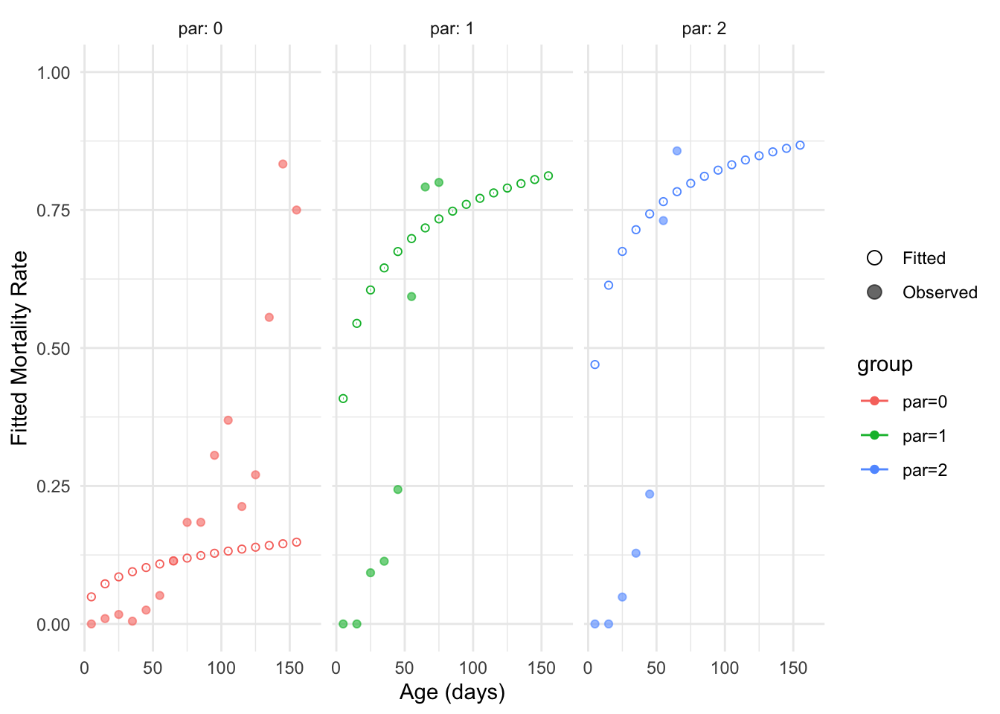

# Standard errors and MCMC

## Create a `lifelihoodData` object

\
[`library`](https://rdrr.io/r/base/library.html)`(`[`lifelihood`](https://nrode.github.io/Lifelihood/)`)`\
`#> Loading required package: tidyverse`\
`#> ── Attaching core tidyverse packages ──────────────────────── tidyverse 2.0.0 ──`\
`#> ✔ dplyr     1.2.1     ✔ readr     2.2.0`\
`#> ✔ forcats   1.0.1     ✔ stringr   1.6.0`\
`#> ✔ ggplot2   4.0.3     ✔ tibble    3.3.1`\
`#> ✔ lubridate 1.9.5     ✔ tidyr     1.3.2`\
`#> ✔ purrr     1.2.2     `\
`#> ── Conflicts ────────────────────────────────────────── tidyverse_conflicts() ──`\
`#> ✖ dplyr::filter() masks stats::filter()`\
`#> ✖ dplyr::lag()    masks stats::lag()`\
`#> ℹ Use the conflicted package (<http://conflicted.r-lib.org/>) to force all conflicts to become errors`\
[`library`](https://rdrr.io/r/base/library.html)`(`[`tidyverse`](https://tidyverse.tidyverse.org)`)`\
\
`df`` ``<-`` ``datapierrick`` ``|>`\
`  `[`as_tibble`](https://tibble.tidyverse.org/reference/as_tibble.html)`(``)`` ``|>`\
`  `[`mutate`](https://dplyr.tidyverse.org/reference/mutate.html)`(`\
`    par ``=`` `[`as.factor`](https://rdrr.io/r/base/factor.html)`(``par``)``,`\
`    geno ``=`` `[`as.factor`](https://rdrr.io/r/base/factor.html)`(``geno``)``,`\
`    spore ``=`` `[`as.factor`](https://rdrr.io/r/base/factor.html)`(``spore``)``,`\
`    block ``=`` `[`rep`](https://rdrr.io/r/base/rep.html)`(``1``:``2``, each ``=`` `[`nrow`](https://rdrr.io/r/base/nrow.html)`(``datapierrick``)`` ``/`` ``2``)`\
`  ``)`\
\
`clutchs`` ``<-`` `[`generate_clutch_vector`](https://nrode.github.io/Lifelihood/reference/generate_clutch_vector.md)`(``28``)`\
\
`lifelihoodData`` ``<-`` `[`as_lifelihoodData`](https://nrode.github.io/Lifelihood/reference/as_lifelihoodData.md)`(`\
`  df ``=`` ``df``,`\
`  matclutch ``=`` ``FALSE``,`\
`  sex ``=`` ``"sex"``,`\
`  sex_start ``=`` ``"sex_start"``,`\
`  sex_end ``=`` ``"sex_end"``,`\
`  maturity_start ``=`` ``"mat_start"``,`\
`  maturity_end ``=`` ``"mat_end"``,`\
`  clutchs ``=`` ``clutchs``,`\
`  block ``=`` ``"block"``,`\
`  death_start ``=`` ``"death_start"``,`\
`  death_end ``=`` ``"death_end"``,`\
`  covariates ``=`` `[`c`](https://rdrr.io/r/base/c.html)`(``"par"``, ``"spore"``)``,`\
`  dist ``=`` `[`c`](https://rdrr.io/r/base/c.html)`(``mortality ``=`` ``"wei"``, maturity ``=`` ``"gam"``, reproduction ``=`` ``"lgn"``)`\
`)`

## Standard errors

By default, lifelihood will not try to fit standard errors. But, you can
use the `se.fit` argument for this purpose:

\
\
`## Fail to compute standard errors due to absence of convergence to the ML optimum`\
`results_wrong`` ``<-`` `[`lifelihood`](https://nrode.github.io/Lifelihood/reference/lifelihood.md)`(`\
`  lifelihoodData ``=`` ``lifelihoodData``,`\
`  path_config ``=`` `[`use_test_config`](https://nrode.github.io/Lifelihood/reference/use_test_config.md)`(``"example_config_se"``)``,`\
`  se.fit ``=`` ``TRUE``,`\
`  seed ``=`` `[`c`](https://rdrr.io/r/base/c.html)`(``103``, ``349``, ``1213``, ``1283``)`\
`)`\
\
`## Change sees to converge to the ML optimum`\
[`set.seed`](https://rdrr.io/r/base/Random.html)`(``123``)`\
`results`` ``<-`` `[`lifelihood`](https://nrode.github.io/Lifelihood/reference/lifelihood.md)`(`\
`  lifelihoodData ``=`` ``lifelihoodData``,`\
`  path_config ``=`` `[`use_test_config`](https://nrode.github.io/Lifelihood/reference/use_test_config.md)`(``"example_config_se"``)``,`\
`  se.fit ``=`` ``TRUE``,`\
`  n_fit ``=`` ``5`\
`)`\
`#> Warning in lifelihood(lifelihoodData = lifelihoodData, path_config =`\
`#> use_test_config("example_config_se"), : Best and second-best likelihoods differ`\
`#> by 0.552 (> 0.1). Consider increasing n_fit (currently 5) to be sure of model`\
`#> convergence and find the model with highest log-likelihood.`\
\
`## New model has better convergence`\
[`logLik`](https://rdrr.io/r/stats/logLik.html)`(``results_wrong``)`\
`#> [1] -343783.4`\
[`logLik`](https://rdrr.io/r/stats/logLik.html)`(``results``)`\
`#> [1] -343783.9`\
\
[`summary`](https://rdrr.io/r/base/summary.html)`(``results``)`\
`#> `\
`#> === LIFELIHOOD RESULTS ===`\
`#> `\
`#> Sample size: 550 `\
`#> `\
`#> --- Model Fit ---`\
`#> Log-likelihood:  -343783.924`\
`#> AIC:             687575.8`\
`#> BIC:             687593.1`\
`#> `\
`#> --- Key Parameters ---`\
`#> `\
`#> Mortality:`\
`#>   expt_death (Intercept)    -1.991 (0.070)`\
`#>   expt_death eff_expt_death_par_1 0.306 (0.075)`\
`#>   expt_death eff_expt_death_par_2 0.280 (0.082)`\
`#>   survival_param2 (Intercept) -4.738 (0.065)`\
`#> `\
`#> --- Convergence ---`\
`#> All parameters within bounds`\
`#> `\
`#> ======================`

Now if we have a look at the estimations we have standard errors:

\
`results``$``effects`` ``|>`` `[`as_tibble`](https://tibble.tidyverse.org/reference/as_tibble.html)`(``)`\
`#> # A tibble: 4 × 6`\
`#>   name                 estimation stderror parameter       kind            event`\
`#>   <chr>                     <dbl>    <dbl> <chr>           <chr>           <chr>`\
`#> 1 int_expt_death           -1.99    0.0696 expt_death      intercept       mort…`\
`#> 2 eff_expt_death_par_1      0.306   0.0755 expt_death      coefficient_ca… mort…`\
`#> 3 eff_expt_death_par_2      0.280   0.0815 expt_death      coefficient_ca… mort…`\
`#> 4 int_survival_param2      -4.74    0.0653 survival_param2 intercept       mort…`

## Prediction

We can predict with standard errors.

- Default scale

\
[`prediction`](https://nrode.github.io/Lifelihood/reference/prediction.md)`(``results``, ``"expt_death"``, se.fit ``=`` ``TRUE``)`` ``|>`\
`  `[`as_tibble`](https://tibble.tidyverse.org/reference/as_tibble.html)`(``)`` ``|>`\
`  `[`sample_n`](https://dplyr.tidyverse.org/reference/sample_n.html)`(``5``)`\
`#> Lifelihood parameter estimate(s) for males are identical to that of females. Use type='response', to get the right parameter estimate(s) for males on the response scale.`\
`#> # A tibble: 5 × 2`\
`#>   fitted se.fitted`\
`#>    <dbl>     <dbl>`\
`#> 1  -1.99    0.0696`\
`#> 2  -1.99    0.0696`\
`#> 3  -1.99    0.0696`\
`#> 4  -1.99    0.0696`\
`#> 5  -1.99    0.0696`

- Response scale

\
[`prediction`](https://nrode.github.io/Lifelihood/reference/prediction.md)`(``results``, ``"expt_death"``, type ``=`` ``"response"``, se.fit ``=`` ``TRUE``)`` ``|>`\
`  `[`as_tibble`](https://tibble.tidyverse.org/reference/as_tibble.html)`(``)`` ``|>`\
`  `[`sample_n`](https://dplyr.tidyverse.org/reference/sample_n.html)`(``5``)`\
`#> # A tibble: 5 × 2`\
`#>   fitted se.fitted`\
`#>    <dbl>     <dbl>`\
`#> 1   38.9      2.38`\
`#> 2   50.7      1.27`\
`#> 3   38.9      2.38`\
`#> 4   38.9      2.38`\
`#> 5   50.7      1.27`

## SE fails with interaction model with MCMC

> MCMC stands for **M**arkov **C**hain **M**onte **C**arlo.

### Fitting with MCMC

\
`results`` ``<-`` `[`lifelihood`](https://nrode.github.io/Lifelihood/reference/lifelihood.md)`(`\
`  lifelihoodData ``=`` ``lifelihoodData``,`\
`  path_config ``=`` `[`use_test_config`](https://nrode.github.io/Lifelihood/reference/use_test_config.md)`(``"example_config_mcmc"``)``,`\
`  MCMC ``=`` ``30`\
`)`

### Visualization

We can represent the confidence interval computed thanks to the standard
errors:

\
[`plot_fitted_event_rate`](https://nrode.github.io/Lifelihood/reference/plot_event_rate.md)`(`\
`  ``results``,`\
`  interval_width ``=`` ``10``,`\
`  event ``=`` ``"mortality"``,`\
`  use_facet ``=`` ``TRUE``,`\
`  groupby ``=`` ``"par"``,`\
`  xlab ``=`` ``"Age (days)"``,`\
`  ylab ``=`` ``"Fitted Mortality Rate"``,`\
`  se.fit ``=`` ``TRUE`\
`)`\
`#> Warning in value[[3L]](cond): Could not compute MCMC standard errors. Number of`\
`#> MCMC iterations (30) must be higher than number of individuals (48).`\
`#> Warning in value[[3L]](cond): Could not compute MCMC standard errors. Number of`\
`#> MCMC iterations (30) must be higher than number of individuals (48).`\
`#> Warning: Removed 20 rows containing missing values or values outside the scale range`\
`` #> (`geom_point()`). ``

