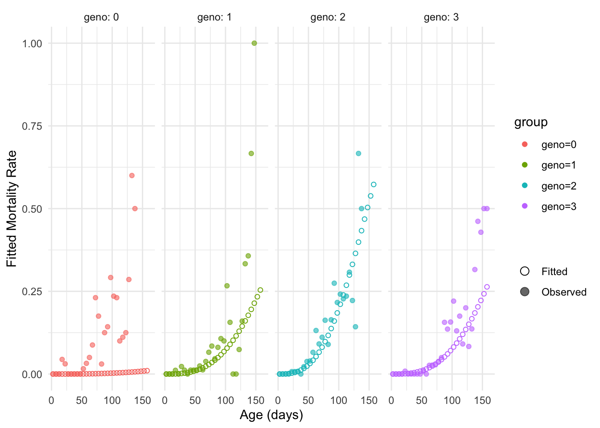
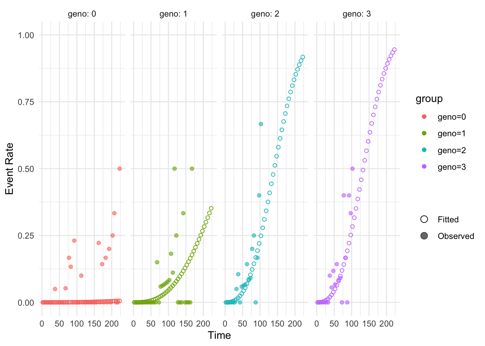

# Reproduction survival tradeoff

## Load libraries

## Analysis

``` r

library(lifelihood)
#> Loading required package: tidyverse
#> ── Attaching core tidyverse packages ──────────────────────── tidyverse 2.0.0 ──
#> ✔ dplyr     1.2.1     ✔ readr     2.2.0
#> ✔ forcats   1.0.1     ✔ stringr   1.6.0
#> ✔ ggplot2   4.0.3     ✔ tibble    3.3.1
#> ✔ lubridate 1.9.5     ✔ tidyr     1.3.2
#> ✔ purrr     1.2.2     
#> ── Conflicts ────────────────────────────────────────── tidyverse_conflicts() ──
#> ✖ dplyr::filter() masks stats::filter()
#> ✖ dplyr::lag()    masks stats::lag()
#> ℹ Use the conflicted package (<http://conflicted.r-lib.org/>) to force all conflicts to become errors
library(tidyverse)

df <- datapierrick |>
  as_tibble() |>
  mutate(
    par = as.factor(par),
    geno = as.factor(geno),
    spore = as.factor(spore)
  ) |>
  filter(par == "0")

df |>
  group_by(geno) |>
  summarise(longevity = mean((death_start + death_end) / 2))
#> # A tibble: 4 × 2
#>   geno  longevity
#>   <fct>     <dbl>
#> 1 0          83.6
#> 2 1         109. 
#> 3 2          81.7
#> 4 3         104.

clutchs <- generate_clutch_vector(28)

lifelihoodData <- as_lifelihoodData(
  df = df,
  sex = "sex",
  sex_start = "sex_start",
  sex_end = "sex_end",
  maturity_start = "mat_start",
  maturity_end = "mat_end",
  clutchs = clutchs,
  death_start = "death_start",
  death_end = "death_end",
  matclutch = FALSE,
  covariates = c("par", "geno"),
  dist = c("wei", "gam", "lgn")
)

## Right convergence
m1 <- lifelihood(
  lifelihoodData = lifelihoodData,
  path_config = use_test_config("config_pierrick_geno_death"),
  raise_estimation_warning = FALSE,
  delete_temp_files = FALSE,
  seeds = c(2054, 9713, 3767, 8573)
  #  n_fit=10
)

AICc(m1)
#> [1] 57830.36629

summary(m1)
#> 
#> === LIFELIHOOD RESULTS ===
#> 
#> Sample size: 411 
#> 
#> --- Model Fit ---
#> Log-likelihood:  -28903.852
#> AIC:             57829.7
#> BIC:             57873.9
#> 
#> --- Key Parameters ---
#> 
#> Mortality:
#>   expt_death (Intercept)    1.592 (0.000)
#>   expt_death eff_expt_death_geno_1 -2.182 (0.000)
#>   expt_death eff_expt_death_geno_2 -2.573 (0.000)
#>   expt_death eff_expt_death_geno_3 -2.199 (0.000)
#>   survival_param2 (Intercept) -0.416 (0.000)
#> 
#> Maturity:
#>   expt_maturity (Intercept) -0.974 (0.000)
#>   maturity_param2 (Intercept) -6.922 (0.000)
#> 
#> Reproduction:
#>   expt_reproduction (Intercept) -1.772 (0.000)
#>   reproduction_param2 (Intercept) -7.521 (0.000)
#>   n_offspring (Intercept)   -2.538 (0.000)
#>   increase_death_hazard (Intercept) -9.789 (0.000)
#> 
#> --- Convergence ---
#> All parameters within bounds
#> 
#> ======================

# Prediction
newdata <- data.frame(geno = 0:3)
newdata$geno <- factor(newdata$geno)

prediction(m1, "expt_death", newdata = newdata, type = "response")
#> [1] 269.20488675 115.51339904  88.34365683 114.26951930

plot_fitted_event_rate(
  m1,
  interval_width = 5,
  event = "mortality",
  use_facet = TRUE,
  groupby = "geno",
  xlab = "Age (days)",
  ylab = "Fitted Mortality Rate"
)
#> Warning: Removed 14 rows containing missing values or values outside the scale range
#> (`geom_point()`).
```



## Simulations

### From Lifelihood results

``` r

simulate_life_history(m1, event = "mortality") |>
  mutate(geno = df$geno) |>
  group_by(geno) |>
  summarise(longevity = mean((mortality_start + mortality_end) / 2))
#> # A tibble: 4 × 2
#>   geno  longevity
#>   <fct>     <dbl>
#> 1 0         254. 
#> 2 1         114. 
#> 3 2          87.9
#> 4 3         111.
```

### From scratch without tradeoffs

``` r

population <- crossing(
  geno = as.factor(0:3),
  sex = 0
) |>
  mutate(n_individuals = 100)


## Define model to simulate
simulation_config <- list(
  mortality = list(
    expt_death = "geno",
    survival_param2 = 1,
    ratio_expt_death = "not_fitted",
    prob_death = "not_fitted",
    sex_ratio = "not_fitted"
  ),
  maturity = list(
    expt_maturity = 1,
    maturity_param2 = 1,
    ratio_expt_maturity = "not_fitted"
  ),
  reproduction = list(
    expt_reproduction = 1,
    reproduction_param2 = 1,
    n_offspring = 1,
    increase_death_hazard = "not_fitted",
    tof_decay = "not_fitted",
    increase_death_hazard_n_offspring = "not_fitted",
    lin_decrease_hazard = "not_fitted",
    quad_decrease_hazard = "not_fitted",
    lin_change_n_offspring = "not_fitted",
    quad_change_n_offspring = "not_fitted",
    tof_n_offspring = "not_fitted",
    fitness = "not_fitted"
  )
)

## Define effects
effects <- list(
  expt_death = list(intercept = coef(m1)[1], geno = coef(m1)[2:4]),
  survival_param2 = coef(m1)[5],
  expt_maturity = coef(m1)[6],
  maturity_param2 = coef(m1)[7],
  expt_reproduction = coef(m1)[8],
  reproduction_param2 = coef(m1)[9],
  n_offspring = coef(m1)[10]
)

## Inputs with distributions
simulation_input <- create_simulation_input(
  effects = effects,
  data = population,
  covariates = c("geno"),
  sex = "sex",
  matclutch = TRUE,
  matclutch_size = "first_clutch_size",
  block = "block",
  config = simulation_config,
  dist = c("wei", "gam", "lgn"),
  n_per_combination = "n_individuals",
  param_bounds_df = m1$param_bounds_df
)

## Add block to dataset
simulation_input$lifelihoodData$df <- data.frame(
  block = rep(1, nrow(simulation_input$lifelihoodData$df)),
  simulation_input$lifelihoodData$df
)

visits <- data.frame(block = 1, visit = seq(1, 200, by = 0.1))

sim_data <- simulate_life_history(
  object = simulation_input,
  event = "all",
  use_censoring = TRUE,
  visits = visits
)
#> [1] "Maturity correspond to first clutch as arguement matclutch is true in the Lifehood object provided"
sim_data
#> # A tibble: 400 × 185
#>    geno  block   sex sex_start sex_end mortality mortality_start mortality_end
#>    <fct> <dbl> <dbl>     <dbl>   <dbl>     <dbl>           <dbl>         <dbl>
#>  1 0         1     0       990    1000      225.            200            NA 
#>  2 0         1     0       990    1000      255.            200            NA 
#>  3 0         1     0       990    1000      112.            112.          112.
#>  4 0         1     0       990    1000      282.            200            NA 
#>  5 0         1     0       990    1000      316.            200            NA 
#>  6 0         1     0       990    1000      232.            200            NA 
#>  7 0         1     0       990    1000      119.            119.          119.
#>  8 0         1     0       990    1000      336.            200            NA 
#>  9 0         1     0       990    1000      298.            200            NA 
#> 10 0         1     0       990    1000      178.            178.          178.
#> # ℹ 390 more rows
#> # ℹ 177 more variables: maturity <dbl>, maturity_start <dbl>,
#> #   maturity_end <dbl>, first_clutch_size <int>, clutch_2 <dbl>,
#> #   clutch_start_2 <dbl>, clutch_end_2 <dbl>, clutch_size_2 <int>,
#> #   clutch_3 <dbl>, clutch_start_3 <dbl>, clutch_end_3 <dbl>,
#> #   clutch_size_3 <int>, clutch_4 <dbl>, clutch_start_4 <dbl>,
#> #   clutch_end_4 <dbl>, clutch_size_4 <int>, clutch_5 <dbl>, …

sim_data |>
  mutate(geno = simulation_input$lifelihoodData$df$geno) |>
  group_by(geno) |>
  summarise(longevity = mean((mortality_start + mortality_end) / 2))
#> # A tibble: 4 × 2
#>   geno  longevity
#>   <fct>     <dbl>
#> 1 0          NA  
#> 2 1         119. 
#> 3 2          87.7
#> 4 3         114.
```

### From scratch with tradeoffs

``` r

population <- crossing(
  geno = as.factor(0:3),
  sex = 0
) |>
  mutate(n_individuals = 20)

## Define model to simulate
simulation_config <- list(
  mortality = list(
    expt_death = "geno",
    survival_param2 = 1,
    ratio_expt_death = "not_fitted",
    prob_death = "not_fitted",
    sex_ratio = "not_fitted"
  ),
  maturity = list(
    expt_maturity = 1,
    maturity_param2 = 1,
    ratio_expt_maturity = "not_fitted"
  ),
  reproduction = list(
    expt_reproduction = 1,
    reproduction_param2 = 1,
    n_offspring = 1,
    increase_death_hazard = 1,
    tof_decay = "not_fitted",
    increase_death_hazard_n_offspring = "not_fitted",
    lin_decrease_hazard = "not_fitted",
    quad_decrease_hazard = "not_fitted",
    lin_change_n_offspring = "not_fitted",
    quad_change_n_offspring = "not_fitted",
    tof_n_offspring = "not_fitted",
    fitness = "not_fitted"
  )
)

## Define effects
effects <- list(
  expt_death = list(intercept = coef(m1)[1], geno = coef(m1)[2:4]),
  survival_param2 = coef(m1)[5],
  increase_death_hazard = -10,
  expt_maturity = coef(m1)[6],
  maturity_param2 = coef(m1)[7],
  expt_reproduction = coef(m1)[8],
  reproduction_param2 = coef(m1)[9],
  n_offspring = coef(m1)[10]
)

## Inputs with distributions
simulation_input <- create_simulation_input(
  effects = effects,
  data = population,
  covariates = c("geno"),
  sex = "sex",
  matclutch = FALSE,
  matclutch_size = "first_clutch_size",
  block = "block",
  config = simulation_config,
  dist = c("wei", "gam", "lgn"),
  n_per_combination = "n_individuals",
  param_bounds_df = m1$param_bounds_df
)

## Add block to dataset
simulation_input$lifelihoodData$df <- data.frame(
  block = rep(1, nrow(simulation_input$lifelihoodData$df)),
  simulation_input$lifelihoodData$df
)

visits <- data.frame(block = 1, visit = seq(1, 200, by = 0.1))
set.seed(123)
sim_data <- simulate_life_history(
  object = simulation_input,
  event = "all",
  use_censoring = FALSE,
  visits = NULL
) |>
  mutate(
    maturity_end = maturity_start + 0.005,
    mortality_end = mortality_start + 0.005,
    across(starts_with("clutch_end_"), ~ .x + 0.005)
  )

sim_data
#> # A tibble: 80 × 151
#>    geno  block   sex sex_start sex_end total_n_offspring maturity_start
#>    <fct> <dbl> <dbl>     <dbl>   <dbl>             <dbl>          <dbl>
#>  1 0         1     0       990    1000               190          13.5 
#>  2 0         1     0       990    1000               167          10.0 
#>  3 0         1     0       990    1000                51          11.5 
#>  4 0         1     0       990    1000               159          11.5 
#>  5 0         1     0       990    1000                67          10.6 
#>  6 0         1     0       990    1000                71          11.8 
#>  7 0         1     0       990    1000               199          13.3 
#>  8 0         1     0       990    1000               226          14.0 
#>  9 0         1     0       990    1000               103           7.95
#> 10 0         1     0       990    1000                85          17.6 
#> # ℹ 70 more rows
#> # ℹ 144 more variables: maturity_end <dbl>, clutch_start_1 <dbl>,
#> #   clutch_end_1 <dbl>, clutch_size_1 <int>, clutch_start_2 <dbl>,
#> #   clutch_end_2 <dbl>, clutch_size_2 <int>, clutch_start_3 <dbl>,
#> #   clutch_end_3 <dbl>, clutch_size_3 <int>, clutch_start_4 <dbl>,
#> #   clutch_end_4 <dbl>, clutch_size_4 <int>, clutch_start_5 <dbl>,
#> #   clutch_end_5 <dbl>, clutch_size_5 <int>, clutch_start_6 <dbl>, …
colnames(sim_data)
#>   [1] "geno"              "block"             "sex"              
#>   [4] "sex_start"         "sex_end"           "total_n_offspring"
#>   [7] "maturity_start"    "maturity_end"      "clutch_start_1"   
#>  [10] "clutch_end_1"      "clutch_size_1"     "clutch_start_2"   
#>  [13] "clutch_end_2"      "clutch_size_2"     "clutch_start_3"   
#>  [16] "clutch_end_3"      "clutch_size_3"     "clutch_start_4"   
#>  [19] "clutch_end_4"      "clutch_size_4"     "clutch_start_5"   
#>  [22] "clutch_end_5"      "clutch_size_5"     "clutch_start_6"   
#>  [25] "clutch_end_6"      "clutch_size_6"     "clutch_start_7"   
#>  [28] "clutch_end_7"      "clutch_size_7"     "clutch_start_8"   
#>  [31] "clutch_end_8"      "clutch_size_8"     "clutch_start_9"   
#>  [34] "clutch_end_9"      "clutch_size_9"     "clutch_start_10"  
#>  [37] "clutch_end_10"     "clutch_size_10"    "clutch_start_11"  
#>  [40] "clutch_end_11"     "clutch_size_11"    "clutch_start_12"  
#>  [43] "clutch_end_12"     "clutch_size_12"    "clutch_start_13"  
#>  [46] "clutch_end_13"     "clutch_size_13"    "clutch_start_14"  
#>  [49] "clutch_end_14"     "clutch_size_14"    "clutch_start_15"  
#>  [52] "clutch_end_15"     "clutch_size_15"    "clutch_start_16"  
#>  [55] "clutch_end_16"     "clutch_size_16"    "clutch_start_17"  
#>  [58] "clutch_end_17"     "clutch_size_17"    "clutch_start_18"  
#>  [61] "clutch_end_18"     "clutch_size_18"    "clutch_start_19"  
#>  [64] "clutch_end_19"     "clutch_size_19"    "clutch_start_20"  
#>  [67] "clutch_end_20"     "clutch_size_20"    "clutch_start_21"  
#>  [70] "clutch_end_21"     "clutch_size_21"    "clutch_start_22"  
#>  [73] "clutch_end_22"     "clutch_size_22"    "clutch_start_23"  
#>  [76] "clutch_end_23"     "clutch_size_23"    "clutch_start_24"  
#>  [79] "clutch_end_24"     "clutch_size_24"    "clutch_start_25"  
#>  [82] "clutch_end_25"     "clutch_size_25"    "clutch_start_26"  
#>  [85] "clutch_end_26"     "clutch_size_26"    "clutch_start_27"  
#>  [88] "clutch_end_27"     "clutch_size_27"    "clutch_start_28"  
#>  [91] "clutch_end_28"     "clutch_size_28"    "clutch_start_29"  
#>  [94] "clutch_end_29"     "clutch_size_29"    "clutch_start_30"  
#>  [97] "clutch_end_30"     "clutch_size_30"    "clutch_start_31"  
#> [100] "clutch_end_31"     "clutch_size_31"    "clutch_start_32"  
#> [103] "clutch_end_32"     "clutch_size_32"    "clutch_start_33"  
#> [106] "clutch_end_33"     "clutch_size_33"    "clutch_start_34"  
#> [109] "clutch_end_34"     "clutch_size_34"    "clutch_start_35"  
#> [112] "clutch_end_35"     "clutch_size_35"    "clutch_start_36"  
#> [115] "clutch_end_36"     "clutch_size_36"    "clutch_start_37"  
#> [118] "clutch_end_37"     "clutch_size_37"    "clutch_start_38"  
#> [121] "clutch_end_38"     "clutch_size_38"    "clutch_start_39"  
#> [124] "clutch_end_39"     "clutch_size_39"    "clutch_start_40"  
#> [127] "clutch_end_40"     "clutch_size_40"    "clutch_start_41"  
#> [130] "clutch_end_41"     "clutch_size_41"    "clutch_start_42"  
#> [133] "clutch_end_42"     "clutch_size_42"    "clutch_start_43"  
#> [136] "clutch_end_43"     "clutch_size_43"    "clutch_start_44"  
#> [139] "clutch_end_44"     "clutch_size_44"    "clutch_start_45"  
#> [142] "clutch_end_45"     "clutch_size_45"    "clutch_start_46"  
#> [145] "clutch_end_46"     "clutch_size_46"    "clutch_start_47"  
#> [148] "clutch_end_47"     "clutch_size_47"    "mortality_start"  
#> [151] "mortality_end"

## Remove LRS
sim_data <- sim_data |>
  select(-total_n_offspring)
```

## Analyse simulations

``` r


sim_data |>
  group_by(geno) |>
  summarise(longevity = mean((mortality_start + mortality_end) / 2))
#> # A tibble: 4 × 2
#>   geno  longevity
#>   <fct>     <dbl>
#> 1 0         132. 
#> 2 1         108. 
#> 3 2          73.9
#> 4 3          71.3

sim_data |>
  #mutate(toto=mortality_start-maturity_start)|>
  #mutate(toto=clutch_start_1-maturity_start)|>
  mutate(toto = mortality_start - clutch_start_19) |>
  summarize(min(toto, na.rm = TRUE))
#> # A tibble: 1 × 1
#>   `min(toto, na.rm = TRUE)`
#>                       <dbl>
#> 1                     0.900

clutchs <- generate_clutch_vector(17)

lifelihoodData <- as_lifelihoodData(
  df = sim_data,
  sex = "sex",
  sex_start = "sex_start",
  sex_end = "sex_end",
  maturity_start = "maturity_start",
  maturity_end = "maturity_end",
  clutchs = clutchs,
  death_start = "mortality_start",
  death_end = "mortality_end",
  matclutch = FALSE,
  covariates = c("geno"),
  dist = c("wei", "gam", "lgn")
)

## Right convergence
m1 <- lifelihood(
  lifelihoodData = lifelihoodData,
  path_config = use_test_config("config_pierrick_geno_death"),
  raise_estimation_warning = FALSE,
  delete_temp_files = FALSE,
  seeds = c(2055, 9713, 3767, 8573),
  sub_interval = 0.05
  #n_fit=10
)

#AICc(m1)
plot_fitted_event_rate(
  m1,
  interval_width = 5,
  event = "mortality",
  groupby = "geno",
  use_facet = TRUE
)
#> Warning: Removed 63 rows containing missing values or values outside the scale range
#> (`geom_point()`).
```


