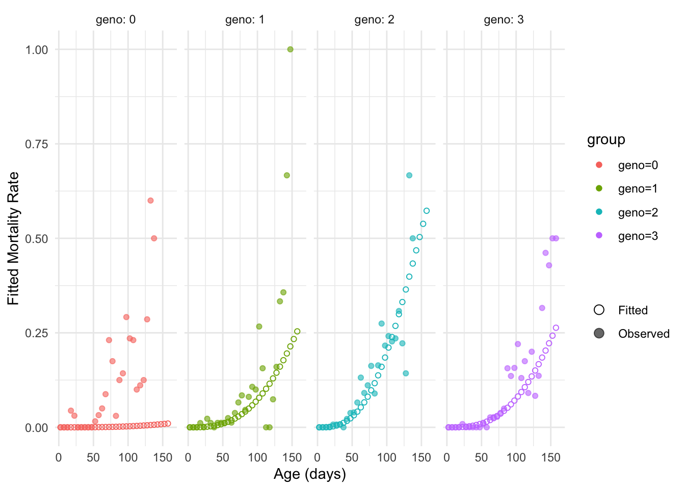
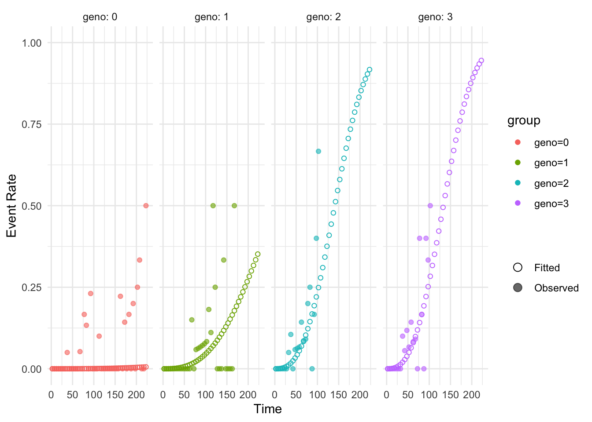

# Reproduction survival tradeoff

## Load libraries

## Analysis

\
[`library`](https://rdrr.io/r/base/library.html)`(`[`lifelihood`](https://nrode.github.io/Lifelihood/)`)`\
`#> Loading required package: tidyverse`\
`#> ── Attaching core tidyverse packages ──────────────────────── tidyverse 2.0.0 ──`\
`#> ✔ dplyr     1.2.1     ✔ readr     2.2.0`\
`#> ✔ forcats   1.0.1     ✔ stringr   1.6.0`\
`#> ✔ ggplot2   4.0.3     ✔ tibble    3.3.1`\
`#> ✔ lubridate 1.9.5     ✔ tidyr     1.3.2`\
`#> ✔ purrr     1.2.2     `\
`#> ── Conflicts ────────────────────────────────────────── tidyverse_conflicts() ──`\
`#> ✖ dplyr::filter() masks stats::filter()`\
`#> ✖ dplyr::lag()    masks stats::lag()`\
`#> ℹ Use the conflicted package (<http://conflicted.r-lib.org/>) to force all conflicts to become errors`\
[`library`](https://rdrr.io/r/base/library.html)`(`[`tidyverse`](https://tidyverse.tidyverse.org)`)`\
\
`df`` ``<-`` ``datapierrick`` ``|>`\
`  `[`as_tibble`](https://tibble.tidyverse.org/reference/as_tibble.html)`(``)`` ``|>`\
`  `[`mutate`](https://dplyr.tidyverse.org/reference/mutate.html)`(`\
`    par ``=`` `[`as.factor`](https://rdrr.io/r/base/factor.html)`(``par``)``,`\
`    geno ``=`` `[`as.factor`](https://rdrr.io/r/base/factor.html)`(``geno``)``,`\
`    spore ``=`` `[`as.factor`](https://rdrr.io/r/base/factor.html)`(``spore``)`\
`  ``)`` ``|>`\
`  `[`filter`](https://dplyr.tidyverse.org/reference/filter.html)`(``par`` ``==`` ``"0"``)`\
\
`df`` ``|>`\
`  `[`group_by`](https://dplyr.tidyverse.org/reference/group_by.html)`(``geno``)`` ``|>`\
`  `[`summarise`](https://dplyr.tidyverse.org/reference/summarise.html)`(``longevity ``=`` `[`mean`](https://rdrr.io/r/base/mean.html)`(``(``death_start`` ``+`` ``death_end``)`` ``/`` ``2``)``)`\
`#> # A tibble: 4 × 2`\
`#>   geno  longevity`\
`#>   <fct>     <dbl>`\
`#> 1 0          83.6`\
`#> 2 1         109. `\
`#> 3 2          81.7`\
`#> 4 3         104.`\
\
`clutchs`` ``<-`` `[`generate_clutch_vector`](https://nrode.github.io/Lifelihood/reference/generate_clutch_vector.md)`(``28``)`\
\
`lifelihoodData`` ``<-`` `[`as_lifelihoodData`](https://nrode.github.io/Lifelihood/reference/as_lifelihoodData.md)`(`\
`  df ``=`` ``df``,`\
`  sex ``=`` ``"sex"``,`\
`  sex_start ``=`` ``"sex_start"``,`\
`  sex_end ``=`` ``"sex_end"``,`\
`  maturity_start ``=`` ``"mat_start"``,`\
`  maturity_end ``=`` ``"mat_end"``,`\
`  clutchs ``=`` ``clutchs``,`\
`  death_start ``=`` ``"death_start"``,`\
`  death_end ``=`` ``"death_end"``,`\
`  matclutch ``=`` ``FALSE``,`\
`  covariates ``=`` `[`c`](https://rdrr.io/r/base/c.html)`(``"par"``, ``"geno"``)``,`\
`  dist ``=`` `[`c`](https://rdrr.io/r/base/c.html)`(``mortality ``=`` ``"wei"``, maturity ``=`` ``"gam"``, reproduction ``=`` ``"lgn"``)`\
`)`\
\
`## Right convergence`\
`m1`` ``<-`` `[`lifelihood`](https://nrode.github.io/Lifelihood/reference/lifelihood.md)`(`\
`  lifelihoodData ``=`` ``lifelihoodData``,`\
`  path_config ``=`` `[`use_test_config`](https://nrode.github.io/Lifelihood/reference/use_test_config.md)`(``"config_pierrick_geno_death"``)``,`\
`  raise_estimation_warning ``=`` ``FALSE``,`\
`  delete_temp_files ``=`` ``FALSE``,`\
`  seeds ``=`` `[`c`](https://rdrr.io/r/base/c.html)`(``2054``, ``9713``, ``3767``, ``8573``)`\
`  ``#  n_fit=10`\
`)`\
\
[`AICc`](https://nrode.github.io/Lifelihood/reference/AICc.md)`(``m1``)`\
`#> [1] 57647.76337`\
\
[`summary`](https://rdrr.io/r/base/summary.html)`(``m1``)`\
`#> `\
`#> === LIFELIHOOD RESULTS ===`\
`#> `\
`#> Sample size: 411 `\
`#> `\
`#> --- Model Fit ---`\
`#> Log-likelihood:  -28812.551`\
`#> AIC:             57647.1`\
`#> BIC:             57691.3`\
`#> `\
`#> --- Key Parameters ---`\
`#> `\
`#> Mortality:`\
`#>   expt_death (Intercept)    -1.015 (0.000)`\
`#>   expt_death eff_expt_death_geno_1 0.212 (0.000)`\
`#>   expt_death eff_expt_death_geno_2 -0.065 (0.000)`\
`#>   expt_death eff_expt_death_geno_3 0.226 (0.000)`\
`#>   survival_param2 (Intercept) -4.871 (0.000)`\
`#> `\
`#> Maturity:`\
`#>   expt_maturity (Intercept) -0.975 (0.000)`\
`#>   maturity_param2 (Intercept) -7.018 (0.000)`\
`#> `\
`#> Reproduction:`\
`#>   expt_reproduction (Intercept) -4.230 (0.000)`\
`#>   reproduction_param2 (Intercept) -3.386 (0.000)`\
`#>   n_offspring (Intercept)   -2.538 (0.000)`\
`#>   increase_death_hazard (Intercept) -19.274 (0.000)`\
`#> `\
`#> --- Convergence ---`\
`#> All parameters within bounds`\
`#> `\
`#> ======================`\
\
`# Prediction`\
`newdata`` ``<-`` `[`data.frame`](https://rdrr.io/r/base/data.frame.html)`(``geno ``=`` ``0``:``3``)`\
`newdata``$``geno`` ``<-`` `[`factor`](https://rdrr.io/r/base/factor.html)`(``newdata``$``geno``)`\
\
[`prediction`](https://nrode.github.io/Lifelihood/reference/prediction.md)`(``m1``, ``"expt_death"``, newdata ``=`` ``newdata``, type ``=`` ``"response"``)`\
`#> [1]  86.21394060 100.29320697  82.16615269 101.26472405`\
\
[`plot_fitted_event_rate`](https://nrode.github.io/Lifelihood/reference/plot_event_rate.md)`(`\
`  ``m1``,`\
`  interval_width ``=`` ``5``,`\
`  event ``=`` ``"mortality"``,`\
`  use_facet ``=`` ``TRUE``,`\
`  groupby ``=`` ``"geno"``,`\
`  xlab ``=`` ``"Age (days)"``,`\
`  ylab ``=`` ``"Fitted Mortality Rate"`\
`)`\
`#> Warning: Removed 14 rows containing missing values or values outside the scale range`\
`` #> (`geom_point()`). ``

## Simulations

### From Lifelihood results

\
[`simulate_life_history`](https://nrode.github.io/Lifelihood/reference/simulate_life_history.md)`(``m1``, event ``=`` ``"mortality"``)`` ``|>`\
`  `[`mutate`](https://dplyr.tidyverse.org/reference/mutate.html)`(``geno ``=`` ``df``$``geno``)`` ``|>`\
`  `[`group_by`](https://dplyr.tidyverse.org/reference/group_by.html)`(``geno``)`` ``|>`\
`  `[`summarise`](https://dplyr.tidyverse.org/reference/summarise.html)`(``longevity ``=`` `[`mean`](https://rdrr.io/r/base/mean.html)`(``(``mortality_start`` ``+`` ``mortality_end``)`` ``/`` ``2``)``)`\
`#> # A tibble: 4 × 2`\
`#>   geno  longevity`\
`#>   <fct>     <dbl>`\
`#> 1 0          88.4`\
`#> 2 1          98.9`\
`#> 3 2          82.3`\
`#> 4 3         109.`

### From scratch without tradeoffs

\
`population`` ``<-`` `[`crossing`](https://tidyr.tidyverse.org/reference/expand.html)`(`\
`  geno ``=`` `[`as.factor`](https://rdrr.io/r/base/factor.html)`(``0``:``3``)``,`\
`  sex ``=`` ``0`\
`)`` ``|>`\
`  `[`mutate`](https://dplyr.tidyverse.org/reference/mutate.html)`(``n_individuals ``=`` ``100``)`\
\
\
`## Define model to simulate`\
`simulation_config`` ``<-`` `[`list`](https://rdrr.io/r/base/list.html)`(`\
`  mortality ``=`` `[`list`](https://rdrr.io/r/base/list.html)`(`\
`    expt_death ``=`` ``"geno"``,`\
`    survival_param2 ``=`` ``1``,`\
`    ratio_expt_death ``=`` ``"not_fitted"``,`\
`    prob_death ``=`` ``"not_fitted"``,`\
`    sex_ratio ``=`` ``"not_fitted"`\
`  ``)``,`\
`  maturity ``=`` `[`list`](https://rdrr.io/r/base/list.html)`(`\
`    expt_maturity ``=`` ``1``,`\
`    maturity_param2 ``=`` ``1``,`\
`    ratio_expt_maturity ``=`` ``"not_fitted"`\
`  ``)``,`\
`  reproduction ``=`` `[`list`](https://rdrr.io/r/base/list.html)`(`\
`    expt_reproduction ``=`` ``1``,`\
`    reproduction_param2 ``=`` ``1``,`\
`    n_offspring ``=`` ``1``,`\
`    increase_death_hazard ``=`` ``"not_fitted"``,`\
`    tof_decay ``=`` ``"not_fitted"``,`\
`    increase_death_hazard_n_offspring ``=`` ``"not_fitted"``,`\
`    lin_decrease_hazard ``=`` ``"not_fitted"``,`\
`    quad_decrease_hazard ``=`` ``"not_fitted"``,`\
`    lin_change_n_offspring ``=`` ``"not_fitted"``,`\
`    quad_change_n_offspring ``=`` ``"not_fitted"``,`\
`    tof_n_offspring ``=`` ``"not_fitted"``,`\
`    fitness ``=`` ``"not_fitted"`\
`  ``)`\
`)`\
\
`## Define effects`\
`effects`` ``<-`` `[`list`](https://rdrr.io/r/base/list.html)`(`\
`  expt_death ``=`` `[`list`](https://rdrr.io/r/base/list.html)`(``intercept ``=`` `[`coef`](https://nrode.github.io/Lifelihood/reference/coef.md)`(``m1``)``[``1``]``, geno ``=`` `[`coef`](https://nrode.github.io/Lifelihood/reference/coef.md)`(``m1``)``[``2``:``4``]``)``,`\
`  survival_param2 ``=`` `[`coef`](https://nrode.github.io/Lifelihood/reference/coef.md)`(``m1``)``[``5``]``,`\
`  expt_maturity ``=`` `[`coef`](https://nrode.github.io/Lifelihood/reference/coef.md)`(``m1``)``[``6``]``,`\
`  maturity_param2 ``=`` `[`coef`](https://nrode.github.io/Lifelihood/reference/coef.md)`(``m1``)``[``7``]``,`\
`  expt_reproduction ``=`` `[`coef`](https://nrode.github.io/Lifelihood/reference/coef.md)`(``m1``)``[``8``]``,`\
`  reproduction_param2 ``=`` `[`coef`](https://nrode.github.io/Lifelihood/reference/coef.md)`(``m1``)``[``9``]``,`\
`  n_offspring ``=`` `[`coef`](https://nrode.github.io/Lifelihood/reference/coef.md)`(``m1``)``[``10``]`\
`)`\
\
`## Inputs with distributions`\
`simulation_input`` ``<-`` `[`create_simulation_input`](https://nrode.github.io/Lifelihood/reference/create_simulation_input.md)`(`\
`  effects ``=`` ``effects``,`\
`  data ``=`` ``population``,`\
`  covariates ``=`` `[`c`](https://rdrr.io/r/base/c.html)`(``"geno"``)``,`\
`  sex ``=`` ``"sex"``,`\
`  matclutch ``=`` ``TRUE``,`\
`  matclutch_size ``=`` ``"first_clutch_size"``,`\
`  block ``=`` ``"block"``,`\
`  config ``=`` ``simulation_config``,`\
`  dist ``=`` `[`c`](https://rdrr.io/r/base/c.html)`(``mortality ``=`` ``"wei"``, maturity ``=`` ``"gam"``, reproduction ``=`` ``"lgn"``)``,`\
`  n_per_combination ``=`` ``"n_individuals"``,`\
`  param_bounds_df ``=`` ``m1``$``param_bounds_df`\
`)`\
\
`## Add block to dataset`\
`simulation_input``$``lifelihoodData``$``df`` ``<-`` `[`data.frame`](https://rdrr.io/r/base/data.frame.html)`(`\
`  block ``=`` `[`rep`](https://rdrr.io/r/base/rep.html)`(``1``, `[`nrow`](https://rdrr.io/r/base/nrow.html)`(``simulation_input``$``lifelihoodData``$``df``)``)``,`\
`  ``simulation_input``$``lifelihoodData``$``df`\
`)`\
\
`visits`` ``<-`` `[`data.frame`](https://rdrr.io/r/base/data.frame.html)`(``block ``=`` ``1``, visit ``=`` `[`seq`](https://rdrr.io/r/base/seq.html)`(``0``, ``1000``, by ``=`` ``0.1``)``)`\
\
`sim_data`` ``<-`` `[`simulate_life_history`](https://nrode.github.io/Lifelihood/reference/simulate_life_history.md)`(`\
`  object ``=`` ``simulation_input``,`\
`  event ``=`` ``"all"``,`\
`  visits ``=`` ``visits`\
`)`\
`#> [1] "Maturity correspond to first clutch as arguement matclutch is true in the Lifehood object provided"`\
`sim_data`\
`#> # A tibble: 400 × 107`\
`#>    geno  block   sex sex_start sex_end mortality mortality_start mortality_end`\
`#>    <fct> <dbl> <dbl>     <dbl>   <dbl>     <dbl>           <dbl>         <dbl>`\
`#>  1 0         1     0       990    1000      72.0            72            72.1`\
`#>  2 0         1     0       990    1000     110.            110.          110. `\
`#>  3 0         1     0       990    1000      74.3            74.2          74.3`\
`#>  4 0         1     0       990    1000      66.6            66.5          66.6`\
`#>  5 0         1     0       990    1000      92.4            92.3          92.4`\
`#>  6 0         1     0       990    1000      29.6            29.6          29.7`\
`#>  7 0         1     0       990    1000     110.            110.          110. `\
`#>  8 0         1     0       990    1000     125.            124.          125. `\
`#>  9 0         1     0       990    1000      98.3            98.3          98.4`\
`#> 10 0         1     0       990    1000      87.4            87.4          87.5`\
`#> # ℹ 390 more rows`\
`#> # ℹ 99 more variables: maturity <dbl>, maturity_start <dbl>,`\
`#> #   maturity_end <dbl>, first_clutch_size <int>, clutch_start_2 <dbl>,`\
`#> #   clutch_end_2 <dbl>, clutch_size_2 <int>, clutch_start_3 <dbl>,`\
`#> #   clutch_end_3 <dbl>, clutch_size_3 <int>, clutch_start_4 <dbl>,`\
`#> #   clutch_end_4 <dbl>, clutch_size_4 <int>, clutch_start_5 <dbl>,`\
`#> #   clutch_end_5 <dbl>, clutch_size_5 <int>, clutch_start_6 <dbl>, …`\
\
`sim_data`` ``|>`\
`  `[`mutate`](https://dplyr.tidyverse.org/reference/mutate.html)`(``geno ``=`` ``simulation_input``$``lifelihoodData``$``df``$``geno``)`` ``|>`\
`  `[`group_by`](https://dplyr.tidyverse.org/reference/group_by.html)`(``geno``)`` ``|>`\
`  `[`summarise`](https://dplyr.tidyverse.org/reference/summarise.html)`(``longevity ``=`` `[`mean`](https://rdrr.io/r/base/mean.html)`(``(``mortality_start`` ``+`` ``mortality_end``)`` ``/`` ``2``)``)`\
`#> # A tibble: 4 × 2`\
`#>   geno  longevity`\
`#>   <fct>     <dbl>`\
`#> 1 0          88.4`\
`#> 2 1          97.6`\
`#> 3 2          86.5`\
`#> 4 3         101.`

### From scratch with tradeoffs

\
`population`` ``<-`` `[`crossing`](https://tidyr.tidyverse.org/reference/expand.html)`(`\
`  geno ``=`` `[`as.factor`](https://rdrr.io/r/base/factor.html)`(``0``:``3``)``,`\
`  sex ``=`` ``0`\
`)`` ``|>`\
`  `[`mutate`](https://dplyr.tidyverse.org/reference/mutate.html)`(``n_individuals ``=`` ``20``)`\
\
`## Define model to simulate`\
`simulation_config`` ``<-`` `[`list`](https://rdrr.io/r/base/list.html)`(`\
`  mortality ``=`` `[`list`](https://rdrr.io/r/base/list.html)`(`\
`    expt_death ``=`` ``"geno"``,`\
`    survival_param2 ``=`` ``1``,`\
`    ratio_expt_death ``=`` ``"not_fitted"``,`\
`    prob_death ``=`` ``"not_fitted"``,`\
`    sex_ratio ``=`` ``"not_fitted"`\
`  ``)``,`\
`  maturity ``=`` `[`list`](https://rdrr.io/r/base/list.html)`(`\
`    expt_maturity ``=`` ``1``,`\
`    maturity_param2 ``=`` ``1``,`\
`    ratio_expt_maturity ``=`` ``"not_fitted"`\
`  ``)``,`\
`  reproduction ``=`` `[`list`](https://rdrr.io/r/base/list.html)`(`\
`    expt_reproduction ``=`` ``1``,`\
`    reproduction_param2 ``=`` ``1``,`\
`    n_offspring ``=`` ``1``,`\
`    increase_death_hazard ``=`` ``1``,`\
`    tof_decay ``=`` ``"not_fitted"``,`\
`    increase_death_hazard_n_offspring ``=`` ``"not_fitted"``,`\
`    lin_decrease_hazard ``=`` ``"not_fitted"``,`\
`    quad_decrease_hazard ``=`` ``"not_fitted"``,`\
`    lin_change_n_offspring ``=`` ``"not_fitted"``,`\
`    quad_change_n_offspring ``=`` ``"not_fitted"``,`\
`    tof_n_offspring ``=`` ``"not_fitted"``,`\
`    fitness ``=`` ``"not_fitted"`\
`  ``)`\
`)`\
\
`## Define effects`\
`effects`` ``<-`` `[`list`](https://rdrr.io/r/base/list.html)`(`\
`  expt_death ``=`` `[`list`](https://rdrr.io/r/base/list.html)`(``intercept ``=`` `[`coef`](https://nrode.github.io/Lifelihood/reference/coef.md)`(``m1``)``[``1``]``, geno ``=`` `[`coef`](https://nrode.github.io/Lifelihood/reference/coef.md)`(``m1``)``[``2``:``4``]``)``,`\
`  survival_param2 ``=`` `[`coef`](https://nrode.github.io/Lifelihood/reference/coef.md)`(``m1``)``[``5``]``,`\
`  increase_death_hazard ``=`` ``-``10``,`\
`  expt_maturity ``=`` `[`coef`](https://nrode.github.io/Lifelihood/reference/coef.md)`(``m1``)``[``6``]``,`\
`  maturity_param2 ``=`` `[`coef`](https://nrode.github.io/Lifelihood/reference/coef.md)`(``m1``)``[``7``]``,`\
`  expt_reproduction ``=`` `[`coef`](https://nrode.github.io/Lifelihood/reference/coef.md)`(``m1``)``[``8``]``,`\
`  reproduction_param2 ``=`` `[`coef`](https://nrode.github.io/Lifelihood/reference/coef.md)`(``m1``)``[``9``]``,`\
`  n_offspring ``=`` `[`coef`](https://nrode.github.io/Lifelihood/reference/coef.md)`(``m1``)``[``10``]`\
`)`\
\
`## Inputs with distributions`\
`simulation_input`` ``<-`` `[`create_simulation_input`](https://nrode.github.io/Lifelihood/reference/create_simulation_input.md)`(`\
`  effects ``=`` ``effects``,`\
`  data ``=`` ``population``,`\
`  covariates ``=`` `[`c`](https://rdrr.io/r/base/c.html)`(``"geno"``)``,`\
`  sex ``=`` ``"sex"``,`\
`  matclutch ``=`` ``FALSE``,`\
`  matclutch_size ``=`` ``"first_clutch_size"``,`\
`  block ``=`` ``"block"``,`\
`  config ``=`` ``simulation_config``,`\
`  dist ``=`` `[`c`](https://rdrr.io/r/base/c.html)`(``mortality ``=`` ``"wei"``, maturity ``=`` ``"gam"``, reproduction ``=`` ``"lgn"``)``,`\
`  n_per_combination ``=`` ``"n_individuals"``,`\
`  param_bounds_df ``=`` ``m1``$``param_bounds_df`\
`)`\
\
`## Add block to dataset`\
`simulation_input``$``lifelihoodData``$``df`` ``<-`` `[`data.frame`](https://rdrr.io/r/base/data.frame.html)`(`\
`  block ``=`` `[`rep`](https://rdrr.io/r/base/rep.html)`(``1``, `[`nrow`](https://rdrr.io/r/base/nrow.html)`(``simulation_input``$``lifelihoodData``$``df``)``)``,`\
`  ``simulation_input``$``lifelihoodData``$``df`\
`)`\
\
`visits`` ``<-`` `[`data.frame`](https://rdrr.io/r/base/data.frame.html)`(``block ``=`` ``1``, visit ``=`` `[`seq`](https://rdrr.io/r/base/seq.html)`(``1``, ``200``, by ``=`` ``0.1``)``)`\
[`set.seed`](https://rdrr.io/r/base/Random.html)`(``123``)`\
`sim_data`` ``<-`` `[`simulate_life_history`](https://nrode.github.io/Lifelihood/reference/simulate_life_history.md)`(`\
`  object ``=`` ``simulation_input``,`\
`  event ``=`` ``"all"`\
`)`` ``|>`\
`  `[`mutate`](https://dplyr.tidyverse.org/reference/mutate.html)`(`\
`    maturity_end ``=`` ``maturity_start`` ``+`` ``0.005``,`\
`    mortality_end ``=`` ``mortality_start`` ``+`` ``0.005``,`\
`    `[`across`](https://dplyr.tidyverse.org/reference/across.html)`(`[`starts_with`](https://tidyselect.r-lib.org/reference/starts_with.html)`(``"clutch_end_"``)``, ``~`` ``.x`` ``+`` ``0.005``)`\
`  ``)`\
\
`sim_data`\
`#> # A tibble: 80 × 119`\
`#>    geno  block   sex sex_start sex_end total_n_offspring total_n_clutches`\
`#>    <fct> <dbl> <dbl>     <dbl>   <dbl>             <dbl>            <dbl>`\
`#>  1 0         1     0       990    1000               100               19`\
`#>  2 0         1     0       990    1000                75               17`\
`#>  3 0         1     0       990    1000               118               24`\
`#>  4 0         1     0       990    1000                34                8`\
`#>  5 0         1     0       990    1000                51               13`\
`#>  6 0         1     0       990    1000               109               19`\
`#>  7 0         1     0       990    1000                53               10`\
`#>  8 0         1     0       990    1000                67               15`\
`#>  9 0         1     0       990    1000                38                9`\
`#> 10 0         1     0       990    1000               119               23`\
`#> # ℹ 70 more rows`\
`#> # ℹ 112 more variables: maturity_start <dbl>, maturity_end <dbl>,`\
`#> #   clutch_start_1 <dbl>, clutch_end_1 <dbl>, clutch_size_1 <int>,`\
`#> #   clutch_start_2 <dbl>, clutch_end_2 <dbl>, clutch_size_2 <int>,`\
`#> #   clutch_start_3 <dbl>, clutch_end_3 <dbl>, clutch_size_3 <int>,`\
`#> #   clutch_start_4 <dbl>, clutch_end_4 <dbl>, clutch_size_4 <int>,`\
`#> #   clutch_start_5 <dbl>, clutch_end_5 <dbl>, clutch_size_5 <int>, …`\
[`colnames`](https://rdrr.io/r/base/colnames.html)`(``sim_data``)`\
`#>   [1] "geno"              "block"             "sex"              `\
`#>   [4] "sex_start"         "sex_end"           "total_n_offspring"`\
`#>   [7] "total_n_clutches"  "maturity_start"    "maturity_end"     `\
`#>  [10] "clutch_start_1"    "clutch_end_1"      "clutch_size_1"    `\
`#>  [13] "clutch_start_2"    "clutch_end_2"      "clutch_size_2"    `\
`#>  [16] "clutch_start_3"    "clutch_end_3"      "clutch_size_3"    `\
`#>  [19] "clutch_start_4"    "clutch_end_4"      "clutch_size_4"    `\
`#>  [22] "clutch_start_5"    "clutch_end_5"      "clutch_size_5"    `\
`#>  [25] "clutch_start_6"    "clutch_end_6"      "clutch_size_6"    `\
`#>  [28] "clutch_start_7"    "clutch_end_7"      "clutch_size_7"    `\
`#>  [31] "clutch_start_8"    "clutch_end_8"      "clutch_size_8"    `\
`#>  [34] "clutch_start_9"    "clutch_end_9"      "clutch_size_9"    `\
`#>  [37] "clutch_start_10"   "clutch_end_10"     "clutch_size_10"   `\
`#>  [40] "clutch_start_11"   "clutch_end_11"     "clutch_size_11"   `\
`#>  [43] "clutch_start_12"   "clutch_end_12"     "clutch_size_12"   `\
`#>  [46] "clutch_start_13"   "clutch_end_13"     "clutch_size_13"   `\
`#>  [49] "clutch_start_14"   "clutch_end_14"     "clutch_size_14"   `\
`#>  [52] "clutch_start_15"   "clutch_end_15"     "clutch_size_15"   `\
`#>  [55] "clutch_start_16"   "clutch_end_16"     "clutch_size_16"   `\
`#>  [58] "clutch_start_17"   "clutch_end_17"     "clutch_size_17"   `\
`#>  [61] "clutch_start_18"   "clutch_end_18"     "clutch_size_18"   `\
`#>  [64] "clutch_start_19"   "clutch_end_19"     "clutch_size_19"   `\
`#>  [67] "clutch_start_20"   "clutch_end_20"     "clutch_size_20"   `\
`#>  [70] "clutch_start_21"   "clutch_end_21"     "clutch_size_21"   `\
`#>  [73] "clutch_start_22"   "clutch_end_22"     "clutch_size_22"   `\
`#>  [76] "clutch_start_23"   "clutch_end_23"     "clutch_size_23"   `\
`#>  [79] "clutch_start_24"   "clutch_end_24"     "clutch_size_24"   `\
`#>  [82] "clutch_start_25"   "clutch_end_25"     "clutch_size_25"   `\
`#>  [85] "clutch_start_26"   "clutch_end_26"     "clutch_size_26"   `\
`#>  [88] "clutch_start_27"   "clutch_end_27"     "clutch_size_27"   `\
`#>  [91] "clutch_start_28"   "clutch_end_28"     "clutch_size_28"   `\
`#>  [94] "clutch_start_29"   "clutch_end_29"     "clutch_size_29"   `\
`#>  [97] "clutch_start_30"   "clutch_end_30"     "clutch_size_30"   `\
`#> [100] "clutch_start_31"   "clutch_end_31"     "clutch_size_31"   `\
`#> [103] "clutch_start_32"   "clutch_end_32"     "clutch_size_32"   `\
`#> [106] "clutch_start_33"   "clutch_end_33"     "clutch_size_33"   `\
`#> [109] "clutch_start_34"   "clutch_end_34"     "clutch_size_34"   `\
`#> [112] "clutch_start_35"   "clutch_end_35"     "clutch_size_35"   `\
`#> [115] "clutch_start_36"   "clutch_end_36"     "clutch_size_36"   `\
`#> [118] "mortality_start"   "mortality_end"`\
\
`## Remove LRS`\
`sim_data`` ``<-`` ``sim_data`` ``|>`\
`  `[`select`](https://dplyr.tidyverse.org/reference/select.html)`(``-``total_n_offspring``)`

## Analyse simulations

\
\
`sim_data`` ``|>`\
`  `[`group_by`](https://dplyr.tidyverse.org/reference/group_by.html)`(``geno``)`` ``|>`\
`  `[`summarise`](https://dplyr.tidyverse.org/reference/summarise.html)`(``longevity ``=`` `[`mean`](https://rdrr.io/r/base/mean.html)`(``(``mortality_start`` ``+`` ``mortality_end``)`` ``/`` ``2``)``)`\
`#> # A tibble: 4 × 2`\
`#>   geno  longevity`\
`#>   <fct>     <dbl>`\
`#> 1 0          84.1`\
`#> 2 1         103. `\
`#> 3 2          84.4`\
`#> 4 3          68.2`\
\
`sim_data`` ``|>`\
`  ``#mutate(toto=mortality_start-maturity_start)|>`\
`  ``#mutate(toto=clutch_start_1-maturity_start)|>`\
`  `[`mutate`](https://dplyr.tidyverse.org/reference/mutate.html)`(``toto ``=`` ``mortality_start`` ``-`` ``clutch_start_19``)`` ``|>`\
`  `[`summarize`](https://dplyr.tidyverse.org/reference/summarise.html)`(`[`min`](https://rdrr.io/r/base/Extremes.html)`(``toto``, na.rm ``=`` ``TRUE``)``)`\
`#> # A tibble: 1 × 1`\
`` #>   `min(toto, na.rm = TRUE)` ``\
`#>                       <dbl>`\
`#> 1                     0.200`\
\
`clutchs`` ``<-`` `[`generate_clutch_vector`](https://nrode.github.io/Lifelihood/reference/generate_clutch_vector.md)`(``17``)`\
\
`lifelihoodData`` ``<-`` `[`as_lifelihoodData`](https://nrode.github.io/Lifelihood/reference/as_lifelihoodData.md)`(`\
`  df ``=`` ``sim_data``,`\
`  sex ``=`` ``"sex"``,`\
`  sex_start ``=`` ``"sex_start"``,`\
`  sex_end ``=`` ``"sex_end"``,`\
`  maturity_start ``=`` ``"maturity_start"``,`\
`  maturity_end ``=`` ``"maturity_end"``,`\
`  clutchs ``=`` ``clutchs``,`\
`  death_start ``=`` ``"mortality_start"``,`\
`  death_end ``=`` ``"mortality_end"``,`\
`  matclutch ``=`` ``FALSE``,`\
`  covariates ``=`` `[`c`](https://rdrr.io/r/base/c.html)`(``"geno"``)``,`\
`  dist ``=`` `[`c`](https://rdrr.io/r/base/c.html)`(``mortality ``=`` ``"wei"``, maturity ``=`` ``"gam"``, reproduction ``=`` ``"lgn"``)`\
`)`\
\
`## Right convergence`\
`m1`` ``<-`` `[`lifelihood`](https://nrode.github.io/Lifelihood/reference/lifelihood.md)`(`\
`  lifelihoodData ``=`` ``lifelihoodData``,`\
`  path_config ``=`` `[`use_test_config`](https://nrode.github.io/Lifelihood/reference/use_test_config.md)`(``"config_pierrick_geno_death"``)``,`\
`  raise_estimation_warning ``=`` ``FALSE``,`\
`  delete_temp_files ``=`` ``FALSE``,`\
`  seeds ``=`` `[`c`](https://rdrr.io/r/base/c.html)`(``2055``, ``9713``, ``3767``, ``8573``)``,`\
`  sub_interval ``=`` ``0.05`\
`  ``#n_fit=10`\
`)`\
\
`#AICc(m1)`\
[`plot_fitted_event_rate`](https://nrode.github.io/Lifelihood/reference/plot_event_rate.md)`(`\
`  ``m1``,`\
`  interval_width ``=`` ``5``,`\
`  event ``=`` ``"mortality"``,`\
`  groupby ``=`` ``"geno"``,`\
`  use_facet ``=`` ``TRUE`\
`)`\
`#> Warning: Removed 39 rows containing missing values or values outside the scale range`\
`` #> (`geom_point()`). ``

