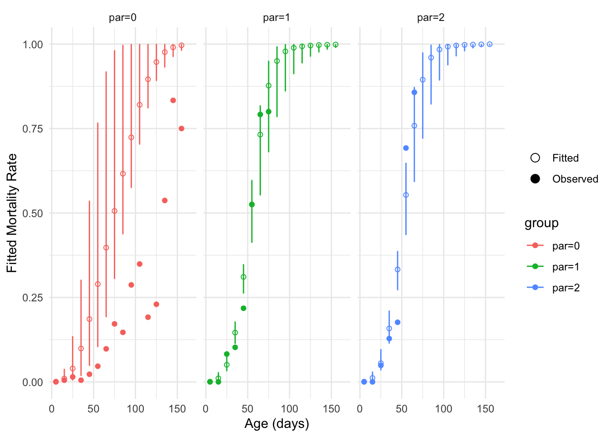

# Standard errors and MCMC

## Create a `lifelihoodData` object

``` r

library(lifelihood)
#> Loading required package: tidyverse
#> ── Attaching core tidyverse packages ──────────────────────── tidyverse 2.0.0 ──
#> ✔ dplyr     1.2.0     ✔ readr     2.1.6
#> ✔ forcats   1.0.1     ✔ stringr   1.6.0
#> ✔ ggplot2   4.0.2     ✔ tibble    3.3.1
#> ✔ lubridate 1.9.5     ✔ tidyr     1.3.2
#> ✔ purrr     1.2.1     
#> ── Conflicts ────────────────────────────────────────── tidyverse_conflicts() ──
#> ✖ dplyr::filter() masks stats::filter()
#> ✖ dplyr::lag()    masks stats::lag()
#> ℹ Use the conflicted package (<http://conflicted.r-lib.org/>) to force all conflicts to become errors
library(tidyverse)

df <- datapierrick |>
  as_tibble() |>
  mutate(
    par = as.factor(par),
    geno = as.factor(geno),
    spore = as.factor(spore),
    block = rep(1:2, each = nrow(datapierrick) / 2)
  )

generate_clutch_vector <- function(N) {
  return(paste(
    "pon",
    rep(c("start", "end", "size"), N),
    rep(1:N, each = 3),
    sep = "_"
  ))
}
clutchs <- generate_clutch_vector(28)

lifelihoodData <- as_lifelihoodData(
  df = df,
  sex = "sex",
  sex_start = "sex_start",
  sex_end = "sex_end",
  maturity_start = "mat_start",
  maturity_end = "mat_end",
  clutchs = clutchs,
  block = "block",
  death_start = "death_start",
  death_end = "death_end",
  covariates = c("par", "spore"),
  model_specs = c("wei", "gam", "lgn")
)
```

## Standard errors

By default, lifelihood will not try to fit standard errors. But, you can
use the `se.fit` argument for this purpose:

``` r
results <- lifelihood(
  lifelihoodData = lifelihoodData,
1  path_config = use_test_config("example_config_se"),
2  se.fit = TRUE,
)
summary(results)
#> [1] "/Users/runner/work/_temp/Library/lifelihood/bin/lifelihood-macos /Users/runner/work/Lifelihood/Lifelihood/lifelihood_/temp_file_data_lifelihood.txt /Users/runner/work/Lifelihood/Lifelihood/lifelihood_/temp_param_range_path.txt FALSE 0 25 TRUE 0 FALSE 0 9237 1491 840 9119 10 20 1000 0.3 NULL 2 2 50 1 1 0.001"
#> 
#> === LIFELIHOOD RESULTS ===
#> 
#> Sample size: 550 
#> 
#> --- Model Fit ---
#> Log-likelihood:  -343783.721
#> AIC:             687575.4
#> BIC:             687592.7
#> 
#> --- Key Parameters ---
#> 
#> Mortality:
#>   expt_death (Intercept)    -1.995 (0.069)
#>   expt_death eff_expt_death_par_1 0.316 (0.074)
#>   expt_death eff_expt_death_par_2 0.304 (0.081)
#>   survival_param2 (Intercept) -0.237 (0.114)
#> 
#> --- Convergence ---
#> All parameters within bounds
#> 
#> ======================
```

- 1:

  Configuration file that determines which model(s) to fit. Learn more
  [here](https://nrode.github.io/Lifelihood/articles/setting-up-the-configuration-file.md).

- 2:

  Default value is `FALSE`.

Now if we have a look at the estimations we have standard errors:

``` r

results$effects |> as_tibble()
#> # A tibble: 4 × 6
#>   name                 estimation stderror parameter       kind            event
#>   <chr>                     <dbl>    <dbl> <chr>           <chr>           <chr>
#> 1 int_expt_death           -2.00    0.0686 expt_death      intercept       mort…
#> 2 eff_expt_death_par_1      0.316   0.0743 expt_death      coefficient_ca… mort…
#> 3 eff_expt_death_par_2      0.304   0.0810 expt_death      coefficient_ca… mort…
#> 4 int_survival_param2      -0.237   0.114  survival_param2 intercept       mort…
```

### Prediction

We can predict with standard errors.

- Default scale

``` r

prediction(results, "expt_death", se.fit = TRUE) |>
  as_tibble() |>
  sample_n(5)
#> # A tibble: 5 × 2
#>   fitted se.fitted
#>    <dbl>     <dbl>
#> 1  -2.00    0.0686
#> 2  -2.00    0.0686
#> 3  -2.00    0.0686
#> 4  -2.00    0.0686
#> 5  -2.00    0.0686
```

- Response scale

``` r

prediction(results, "expt_death", type = "response", se.fit = TRUE) |>
  as_tibble() |>
  sample_n(5)
#> # A tibble: 5 × 2
#>   fitted se.fitted
#>    <dbl>     <dbl>
#> 1   50.9      1.27
#> 2   38.8      2.34
#> 3   38.8      2.34
#> 4   50.4      1.85
#> 5   38.8      2.34
```

## MCMC

> MCMC stands for **M**arkov **C**hain **M**onte **C**arlo.

### Fitting with MCMC

``` r
results <- lifelihood(
  lifelihoodData = lifelihoodData,
  path_config = use_test_config("example_config_mcmc"),
1  MCMC = 30
)
#> [1] "/Users/runner/work/_temp/Library/lifelihood/bin/lifelihood-macos /Users/runner/work/Lifelihood/Lifelihood/lifelihood_/temp_file_data_lifelihood.txt /Users/runner/work/Lifelihood/Lifelihood/lifelihood_/temp_param_range_path.txt FALSE 30 25 FALSE 0 TRUE 0 7995 1813 5009 5155 10 20 1000 0.3 NULL 2 2 50 1 1 0.001"
```

- 1:

  Perform 30 MCMC sampling of the parameter after convergence to
  estimate their 95% confidence interval

### Visualization

We can represent the confidence interval computed thanks to the standard
errors:

``` r

plot_fitted_event_rate(
  results,
  interval_width = 10,
  event = "mortality",
  use_facet = TRUE,
  groupby = "par",
  xlab = "Age (days)",
  ylab = "Fitted Mortality Rate",
  se.fit = TRUE
)
#> Warning: Removed 20 rows containing missing values or values outside the scale range
#> (`geom_point()`).
```


