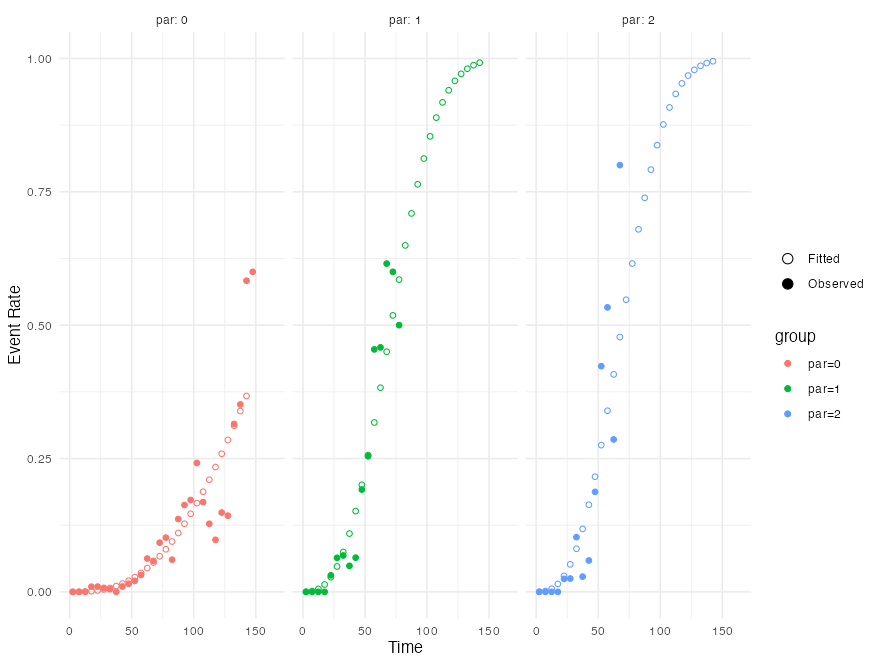

# lifelihood

`lifelihood` is an R package and a class of continuous time multi-event
models which provide the joined likelihood of all the events in an
individual life-history (time of maturity, reproductive events, death).

[Documentation](https://nrode.github.io/Lifelihood/)

It requires R 4.1.0 or later, and work on all of:

- macOS (arm64 and x86)
- Linux (arm64 and x86)
- Windows (x86)

\

## Installation

\
`pak``::`[`pak`](https://pak.r-lib.org/reference/pak.html)`(``"nrode/Lifelihood"``)`

\

## Quick start

\
[`library`](https://rdrr.io/r/base/library.html)`(`[`lifelihood`](https://nrode.github.io/Lifelihood/)`)`\
\
`df`` ``<-`` ``datadaphnia`` ``|>`\
`  ``as_tibble``(``)`` ``|>`\
`  ``mutate``(`\
`    par ``=`` `[`as.factor`](https://rdrr.io/r/base/factor.html)`(``par``)``,`\
`    geno ``=`` `[`as.factor`](https://rdrr.io/r/base/factor.html)`(``geno``)``,`\
`    spore ``=`` `[`as.factor`](https://rdrr.io/r/base/factor.html)`(``spore``)`\
`  ``)`\
\
`clutchs`` ``<-`` `[`generate_clutch_vector`](https://nrode.github.io/Lifelihood/reference/generate_clutch_vector.md)`(``28``)`\
\
`dataLFH`` ``<-`` `[`as_lifelihoodData`](https://nrode.github.io/Lifelihood/reference/as_lifelihoodData.md)`(`\
`  df ``=`` ``df``,`\
`  matclutch ``=`` ``FALSE``,`\
`  sex ``=`` ``"sex"``,`\
`  sex_start ``=`` ``"sex_start"``,`\
`  sex_end ``=`` ``"sex_end"``,`\
`  maturity_start ``=`` ``"mat_start"``,`\
`  maturity_end ``=`` ``"mat_end"``,`\
`  clutchs ``=`` ``clutchs``,`\
`  death_start ``=`` ``"death_start"``,`\
`  death_end ``=`` ``"death_end"``,`\
`  covariates ``=`` `[`c`](https://rdrr.io/r/base/c.html)`(``"geno"``, ``"type"``)``,`\
`  dist ``=`` `[`c`](https://rdrr.io/r/base/c.html)`(``mortality ``=`` ``"gam"``, maturity ``=`` ``"lgn"``, reproduction ``=`` ``"wei"``)`\
`)`\
\
`results`` ``<-`` `[`lifelihood`](https://nrode.github.io/Lifelihood/reference/lifelihood.md)`(`\
`  lifelihoodData ``=`` ``dataLFH``,`\
`  path_config ``=`` `[`system.file`](https://rdrr.io/r/base/system.file.html)`(``"configs/config.yaml"``, package ``=`` ``"lifelihood"``)``,`\
`  seeds ``=`` `[`c`](https://rdrr.io/r/base/c.html)`(``1``, ``2``, ``3``, ``4``)`\
`)`\
[`summary`](https://rdrr.io/r/base/summary.html)`(``results``)`\
`#> === LIFELIHOOD RESULTS ===`\
`#>`\
`#> Sample size: 550`\
`#>`\
`#> --- Model Fit ---`\
`#> Log-likelihood:  -30491.599`\
`#> AIC:             61019.2`\
`#> BIC:             61096.8`\
`#>`\
`#> --- Key Parameters ---`\
`#>`\
`#> Mortality:`\
`#>   expt_death (Intercept)    -0.912 (0.000)`\
`#>   expt_death eff_expt_death_par_1 -0.455 (0.000)`\
`#>   expt_death eff_expt_death_par_2 0.121 (0.000)`\
`#>   expt_death eff_expt_death_spore_1 -0.373 (0.000)`\
`#>   expt_death eff_expt_death_spore_2 -0.303 (0.000)`\
`#>   expt_death eff_expt_death_spore_3 -0.927 (0.000)`\
`#>   survival_param2 (Intercept) -0.480 (0.000)`\
`#>`\
`#> Maturity:`\
`#>   expt_maturity (Intercept) -1.527 (0.000)`\
`#>   expt_maturity eff_expt_maturity_par_1 0.134 (0.000)`\
`#>   expt_maturity eff_expt_maturity_par_2 0.074 (0.000)`\
`#>   maturity_param2 (Intercept) -5.900 (0.000)`\
`#>`\
`#> Reproduction:`\
`#>   expt_reproduction (Intercept) -1.780 (0.000)`\
`#>   expt_reproduction eff_expt_reproduction_par_1 -1.742 (0.000)`\
`#>   expt_reproduction eff_expt_reproduction_par_2 -1.166 (0.000)`\
`#>   reproduction_param2 (Intercept) -7.517 (0.000)`\
`#>   reproduction_param2 eff_reproduction_param2_par_1 0.222 (0.000)`\
`#>   reproduction_param2 eff_reproduction_param2_par_2 0.776 (0.000)`\
`#>   n_offspring (Intercept)   -2.543 (0.000)`\
`#>`\
`#> --- Convergence ---`\
`#> All parameters within bounds`\
`#>`\
`#> ======================`

## Goodness of fit

\
[`coeff`](https://nrode.github.io/Lifelihood/reference/coef.md)`(``results``, ``"expt_death"``)`\
`#> int_expt_death  eff_expt_death_par_1  eff_expt_death_par_2  eff_expt_death_spore_1  eff_expt_death_spore_2  eff_expt_death_spore_3`\
`#> -0.9116360      -0.4551437            0.1214695             -0.3729372              -0.3028974              -0.9274529`\
\
[`AIC`](https://rdrr.io/r/stats/AIC.html)`(``results``)`\
`#> 61019.2`\
\
[`BIC`](https://rdrr.io/r/stats/AIC.html)`(``results``)`\
`#> 61096.78`\
\
[`logLik`](https://rdrr.io/r/stats/logLik.html)`(``results``)`\
`#> -30491.6`

## Prediction

\
[`prediction`](https://nrode.github.io/Lifelihood/reference/prediction.md)`(``results``, ``"expt_death"``, type ``=`` ``"response"``)`` ``|>`` `[`head`](https://rdrr.io/r/utils/head.html)`(``)`\
`#> 92.88023 92.88023 92.88023 92.88023 92.88023 92.88023`

## Visualization

\
[`plot_fitted_event_rate`](https://nrode.github.io/Lifelihood/reference/plot_event_rate.md)`(`\
`  ``results``,`\
`  interval_width ``=`` ``2``,`\
`  event ``=`` ``"mortality"``,`\
`  use_facet ``=`` ``TRUE``,`\
`  groupby ``=`` ``"par"``,`\
`  xlab ``=`` ``"Age (days)"``,`\
`  ylab ``=`` ``"Fitted Mortality Rate"``,`\
`)`

\
\

Learn more and find more examples in the
[documentation](https://nrode.github.io/Lifelihood/).
